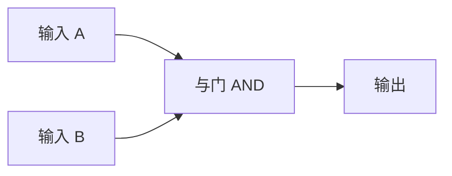
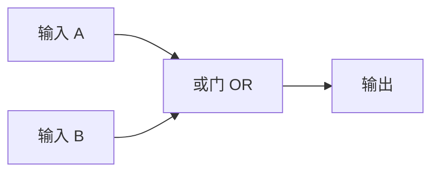

## 什么是逻辑门？

逻辑门（Logic Gates）是数字电路的基本构建单元。它们接收一个或多个二进制输入，根据 [[boolean-algebra|布尔代数]] 规则产生一个二进制输出。

## 基本逻辑门

### 与门（AND Gate）

只有两个输入都是 1 时，输出才是 1。

### 或门（OR Gate）

两个输入中至少有一个是 1 时，输出为 1。

### 非门（NOT Gate / 反相器）

输出和输入相反。

## 组合逻辑门

### 与非门（NAND Gate）

与门 + 非门：只有两个输入都是 1 时，输出才是 0。

### 或非门（NOR Gate）

或门 + 非门：两个输入都是 0 时，输出为 1。

### 异或门（XOR Gate）

两个输入不同时，输出为 1（可用于加法器）。

## 万能的 NAND

有趣的是，**只用与非门（NAND）** 就能构造出所有其他逻辑门。这意味着理论上，只需要一种芯片就能造出整个计算机！

## 从逻辑门到计算机

单个逻辑门很简单，但把它们组合起来，就可以实现：

- **加法器**：用 XOR 和 AND 门实现二进制加法
- **触发器**：用 NAND 或 NOR 门实现存储 1 位数据
- **寄存器**：多个触发器组合存储多位数据
- **ALU**：算术逻辑单元，CPU 的核心

## 小结

逻辑门是连接布尔代数理论和实际硬件的桥梁。从简单的与或非门，到复杂的 CPU，一切计算机硬件都由逻辑门构成。
