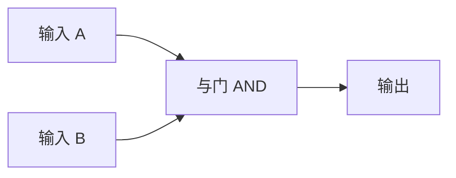
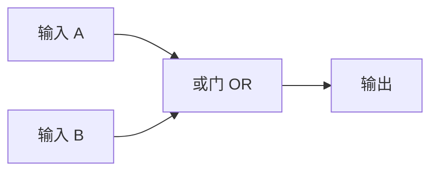

## 什么是逻辑门？

上一节我们学了 [[boolean-algebra|布尔代数]]——那是写在纸上的数学公式。但计算机是物理的，那些 AND、OR、NOT 的运算怎么变成真实的电路呢？

**逻辑门（Logic Gates）就是答案。** 每个逻辑门是一个小小的电路，输入 0 或 1，按布尔代数的规则输出 0 或 1。把逻辑门连接起来，就能搭建出加法器、触发器，乃至整个 CPU。

逻辑门是计算机硬件的"乐高积木"——每块积木做一件简单的事，但组合起来可以创造极其复杂的结构。

## 三种基本逻辑门

### 与门（AND Gate）

还记得布尔代数里的 AND 吗？"两个条件同时满足才为真"。与门就是它的物理实现：**两个输入都是 1 时，输出才为 1**。

### 或门（OR Gate）

"至少一个条件满足即为真"——只要有一个输入是 1，输出就是 1。

### 非门（NOT Gate / 反相器）

最简单的门——一个输入，输出正好反过来。1 变 0，0 变 1。

> 这三个门就是计算机的"基本粒子"。从最简单的手机计算器，到最复杂的超级计算机，所有运算最终都是这三种操作的组合。

## 组合逻辑门

把基本门组合起来，可以得到更有用的复合门。它们本质上**不是新东西**，只是"基本门搭在一起"：

- **与非门（NAND）** = 与门 + 非门：只有两个输入都是 1 时，输出才是 0
- **或非门（NOR）** = 或门 + 非门：两个输入都是 0 时，输出为 1
- **异或门（XOR）** = 两个输入不同时输出 1（后面学加法器时会发现它非常关键）

> 💡 **暂时不需要死记这些复合门的真值表。** 你只需要知道"它们是由基本门组合出来的"就行。后面用到时会自然熟悉。

## 万能的 NAND

有趣的事实：**只用与非门（NAND）这一种门，就能构造出 AND、OR、NOT 等所有其他逻辑门！** 就像中文只有几千个常用汉字，但组合起来可以写出任意复杂的文章。

这意味着理论上，只需要一种芯片就能造出整个计算机。

## 从逻辑门到计算机

单个逻辑门能做的事很少，但把它们组合起来，就可以实现越来越强大的功能：

- 与门 + 或门 + 异或门 → **加法器**（[[half-adder|半加器]]、[[full-adder|全加器]]）
- 与非门交叉连接 → **锁存器**（[[sr-latch|SR 锁存器]]）→ **触发器**（[[d-flipflop|D 触发器]]）→ **寄存器**（[[register|寄存器]]）
- 加法器 + 逻辑门 + 选择器 → **ALU**（[[alu|算术逻辑单元]]）
- 寄存器 + ALU + 控制逻辑 → **CPU**

这就是整棵知识树的路线图。你将从逻辑门开始，一步步亲手构建出计算机的"大脑"。

## 小结

逻辑门是连接数学（布尔代数）和物理（电路）的桥梁。三个基本门——与、或、非——就是所有计算机硬件的起点。接下来，我们将逐个深入每个逻辑门，首先是最简单的 [[and-gate|与门]]。
