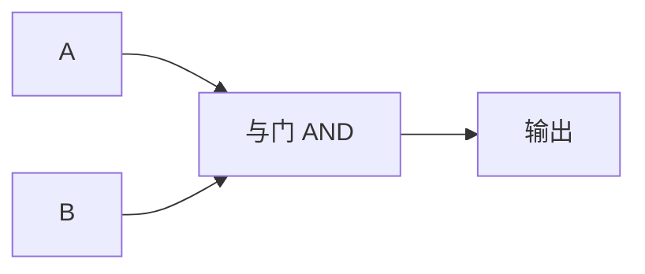

## 与门的真值表

回想一下上一节学过的布尔代数：AND 的含义是"两个条件**同时**满足才为真"。与门（AND Gate）就是这句话的物理实现。

> 你妈妈说过"做完作业**而且**整理好房间才能玩游戏"吗？这就是与门的逻辑。两个条件都满足（作业做完=1、房间整理好=1），你才能玩（输出=1）。任何一个没完成——别想玩。

| 输入 A | 输入 B | 输出 |
|--------|--------|------|
| 0      | 0      | 0    |
| 0      | 1      | 0    |
| 1      | 0      | 0    |
| 1      | 1      | 1    |

注意看这个表：**只有最后一行（两个输入都是 1）输出才是 1**。其他三种情况输出都是 0。这就是与门最核心的性质——"非 1 即 0"的严格性。

## 电路符号



在电路图中，与门常用 **&** 符号或圆点 **·** 表示。

## 生活中的与门

与门不仅存在于计算机芯片里，现实世界中到处都是：

- **ATM 取钱**："插卡正确 **且** 密码正确" → 才能取钱
- **教室投影仪**："电脑开机 **且** 投影按钮按下" → 画面才显示
- **共享单车**："扫码成功 **且** 余额足够" → 锁才打开

每个例子都是"两个条件同时满足 → 结果才发生"——这就是与门。

## 用晶体管造与门

与门不是只有"概念"——它是由晶体管组成的真实电路。一种常见实现：两个串联的晶体管。

```
电源(VCC) ──┬──
            │
        ┌──┴──┐
        │ 晶体管 1 │  ← 输入 A
        └──┬──┘
           │
        ┌──┴──┐
        │ 晶体管 2 │  ← 输入 B
        └──┬──┘
           │
         输出 ═══ 地(GND)
```

- 只有两个晶体管都导通（A=1 **且** B=1），输出才通电（=1）
- 任何一个断开——输出就是 0

这就是数字集成电路的最基础"细胞"——所有复杂计算的起点。

## 小结

| 概念 | 要点 |
|------|------|
| **与门逻辑** | 两个输入都是 1 ⇒ 输出 1 |
| **真值表** | 4 种输入组合，只有 1 种输出 1 |
| **晶体管实现** | 两个晶体管串联 |
| **生活类比** | "既完成作业又整理房间才能玩游戏" |

与门是"严格"的——两个条件缺一不可。和它互补的是[[or-gate|或门]]——"只要有一个就行"。
