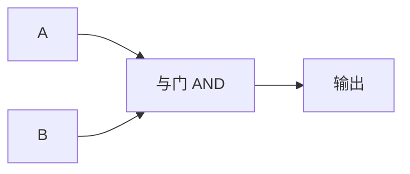

## 与门的真值表

回想一下上一节学过的布尔代数：AND 的含义是"两个条件**同时**满足才为真"。与门（AND Gate）就是这句话的物理实现。

> 你妈妈说过"做完作业**而且**整理好房间才能玩游戏"吗？这就是与门的逻辑。

| 输入 A | 输入 B | 输出 |
|--------|--------|------|
| 0      | 0      | 0    |
| 0      | 1      | 0    |
| 1      | 0      | 0    |
| 1      | 1      | 1    |

注意看这个表：**只有最后一行（两个输入都是 1）输出才是 1**。其他三种情况输出都是 0。这就是与门最核心的性质——"非 1 即 0"的严格性。

## 电路符号



在电路图中，与门常用 **&** 符号或圆点 **·** 表示。

## 生活中的与门

与门在现实生活中无处不在：

- **双重验证**：登录支付宝时，既需要密码正确 **又** 需要短信验证码正确，才能登录成功。这就是一个与门。
- **电梯门**：电梯关门时，既不能有物体挡住左侧传感器，也不能有物体挡住右侧传感器，门才会关闭。
- **学生选课**：既修完了前置课程 **又** 在规定人数内，才能选上课。

## 用继电器理解与门

中学物理学过继电器——用一个电路控制另一个电路的通断。把两个继电器**串联**起来：

```
电源 ──[继电器A]──[继电器B]── 灯泡
```

只有继电器 A **和** 继电器 B 同时接通，灯泡才亮。这就是与门的物理原理。

## 小结

与门很严格——**两个输入必须都是 1，才会输出 1**。这种"缺一不可"的特性在计算机中广泛用于控制信号的"闸门"。接下来，学习另一种逻辑——"有一个就行"的 [[or-gate|或门]]。
