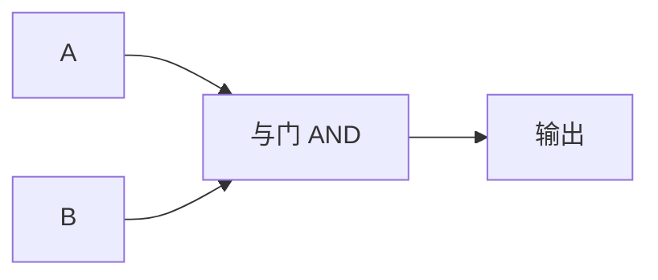

## 与门的真值表

与门（AND Gate）输出两个输入的逻辑与结果。只有 **两个输入都为 1 时，输出才为 1**。

| 输入 A | 输入 B | 输出 |
|--------|--------|------|
| 0      | 0      | 0    |
| 0      | 1      | 0    |
| 1      | 0      | 0    |
| 1      | 1      | 1    |

## 电路符号

在电路图中，与门常用 & 符号或圆点 · 表示。

## 实际应用

- **使能信号**：A 接数据，B 接使能控制，B=1 时数据通过
- **位掩码**：用与运算提取特定位（如 $1010_2$ AND $1100_2$ $=$ $1000_2$）
- **地址译码**：判断多个条件是否同时满足

## 用继电器实现

两个继电器串联：只有两个继电器同时通电，输出端才有电流。

## 小结

与门是最基本的逻辑门之一。配合 [[or-gate|或门]] 和 [[not-gate|非门]]，可以构造出所有数字电路。
