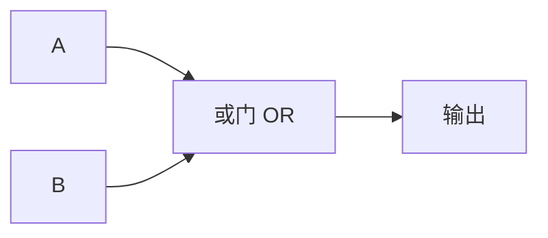
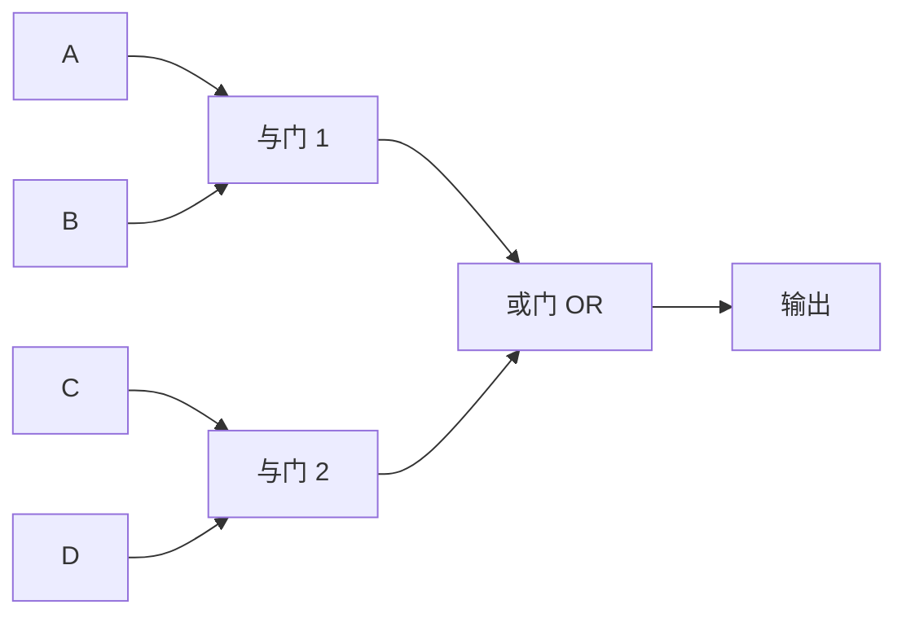

## 或门的真值表

与门很严格——什么都要"两个都是 1"才行。但现实中有很多场景是**有一个就行**：

> 今天食堂有红烧肉 **或者** 有糖醋排骨，你就会去那个窗口——只要有一个菜合胃口就够了。

或门（OR Gate）就是这种"有一个就行"的逻辑。

| 输入 A | 输入 B | 输出 |
|--------|--------|------|
| 0      | 0      | 0    |
| 0      | 1      | 1    |
| 1      | 0      | 1    |
| 1      | 1      | 1    |

注意看：**只有两个输入都是 0 时，输出才是 0**。其他三种情况输出都是 1。跟与门正好相反——与门是"找哪一行是 1"，或门是"找哪一行是 0"。

## 电路符号



在电路图中，或门常用 **≥1** 符号表示——意思是"只要至少有一个输入为 1 就行"。

## 生活中的或门

- **选课系统**：专业选修课中有计算机图形学 **或者** 人工智能，修满学分要求即可——二选一就行。
- **手机闹钟**：周一到周五中任意一天到点就响——满足任意一个条件就触发。
- **校园卡充值提醒**：余额低于 20 元 **或者** 超过 3 天未充值，就推送提醒。

## 用继电器理解或门

把两个继电器**并联**：

```
电源 ──┬──[继电器A]──┐
       │             ├── 灯泡
       └──[继电器B]──┘
```

继电器 A **或** 继电器 B 任何一个接通，灯泡就亮。这就是或门的物理原理。

## 组合与或

现实中的应用很少只用一个门——通常是把多个与门和或门组合使用。例如：



这个电路的功能是：**(A AND B) OR (C AND D)**——左边两个条件同时满足，**或**者右边两个条件同时满足，才会输出 1。

> 💡 这种组合可以类比为选课时的要求："(数学 AND 英语) OR (计算机 AND 物理)"——两组条件中只要有一组全部满足即可。

## 小结

或门很宽松——**只要有一个输入是 1，输出就是 1**。与门是"且"，或门是"或"，它们是数字电路中最基础的两种逻辑。接下来，学习最简单的门——[[not-gate|非门]]。
