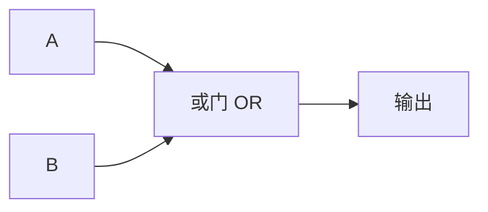

## 或门的真值表

与门很严格——什么都要"两个都是 1"才行。但现实中有很多场景是**有一个就行**：

> 今天食堂有红烧肉 **或者** 有糖醋排骨，你就会去那个窗口——只要有一个菜合胃口就够了。这就是或门：**至少一个输入为 1，输出就是 1**。

| 输入 A | 输入 B | 输出 |
|--------|--------|------|
| 0      | 0      | 0    |
| 0      | 1      | 1    |
| 1      | 0      | 1    |
| 1      | 1      | 1    |

注意看：**只有两个输入都是 0 时，输出才是 0**。其他三种情况输出都是 1。跟与门正好相反。

## 电路符号



在电路图中，或门用 ≥1 符号表示——因为只要"≥1 个"输入为 1，输出就是 1。

## 生活中的或门

- **宿舍门禁**：刷校园卡 **或** 按门铃室友开门 → 都能进
- **双电源供电**：主电源供电 **或** 备用电池供电 → 设备不断电
- **网课签到**：App 签到 **或** 学习委员代签 → 都算你到了

## 或门的晶体管实现

与门是两个晶体管串联，或门则是**并联**：

```
电源(VCC) ──┬──┬──
           │  │
        ┌──┴┐ │
        │晶体管1│ │  ← 输入 A
        └──┬┘ │
           │  │
           │  └──┐
           │  ┌──┴┐
              │晶体管2│  ← 输入 B
              └──┬┘
           │  │
           └──┴──
          输出 ═══ 地(GND)
```

- A 导通或 B 导通——输出 = 1
- 只有两个都断开（A=0 **且** B=0）——输出 = 0

## 小结

| 概念 | 要点 |
|------|------|
| **或门逻辑** | 至少一个输入为 1 ⇒ 输出 1 |
| **与门的区别** | 与门要"两个都是"，或门"有一个就行" |
| **晶体管实现** | 两个晶体管并联 |
| **生活类比** | "红烧肉或糖醋排骨——有一个就去" |

或门是"宽容"的——有一个就行。下一个是[[not-gate|非门]]——它最简单，只有一个输入，做"取反"。
