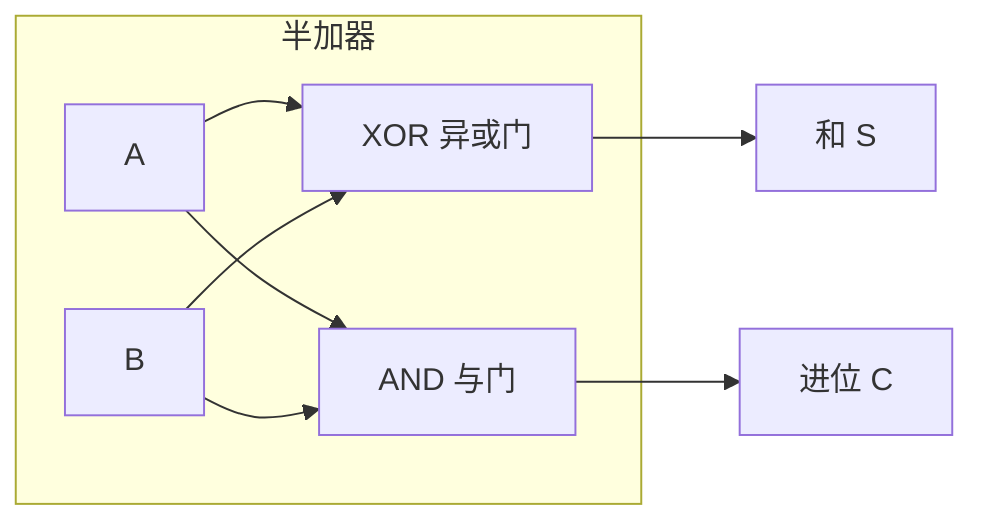

## 什么是半加器？

回想一下小学一年级学竖式计算的时候，你是怎么算 **1 + 1** 的？

```
  1
+ 1
---
  0  余 1 → 进位
```

个位写 0，进上去 1 到十位。**半加器（Half Adder）就是把这个过程用电来实现的电路**——它计算两个二进制位相加，输出"这一位的**结果**（和）"和"要不要进到下一位（进位）"。

## 真值表

两个 1 位二进制数 A、B 相加，可能有 4 种情况：

| A | B | 和 (S) | 进位 (C) |
|---|---|--------|---------|
| 0 | 0 | 0      | 0       |
| 0 | 1 | 1      | 0       |
| 1 | 0 | 1      | 0       |
| 1 | 1 | 0      | 1       |

观察这张表，你有发现什么吗？

- **和（S）列**：0,1,1,0——这不就是 **XOR（异或）** 吗？两个输入不同时为 1，相同时为 0。
- **进位（C）列**：0,0,0,1——这不就是 **AND（与）** 吗？只有两个都是 1 时才为 1。

所以半加器的核心思路就是：用 **XOR 求"和"**，用 **AND 求"进位"**。

> 💡 **为什么不用 OR？** 因为 1+1 的情况，OR 会输出 1（错误），而 AND 正确输出 1（进位）。同时 0+1 时 OR 输出 1（正确），但 XOR 也正确输出 1（和）。XOR 和 AND 刚好互补。

## 电路实现



## 局限性

半加器只能处理**两个**输入位的相加。但在实际计算中，我们经常需要加**三个**位——因为还有来自低位的进位。

比如计算二进制加法 $11 + 01$：

```
  1 1
+ 0 1
-----
  ? ?
```

最低位是 1+1，结果是 0 进位 1。但次低位是 1+0+进位(1)=？半加器没法处理这个"三个数相加"的场景。这就需要[[full-adder|全加器]]来解决。

## 小结

半加器只用两个门——XOR 和 AND——就实现了一位的二进制加法。它是所有加法器乃至 CPU 中 ALU 的基础。但受限于"无法处理进位输入"，我们需要更完善的[[full-adder|全加器]]。
