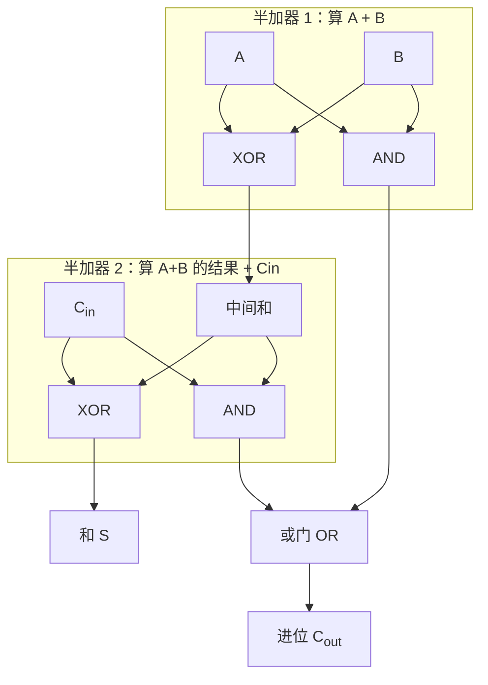
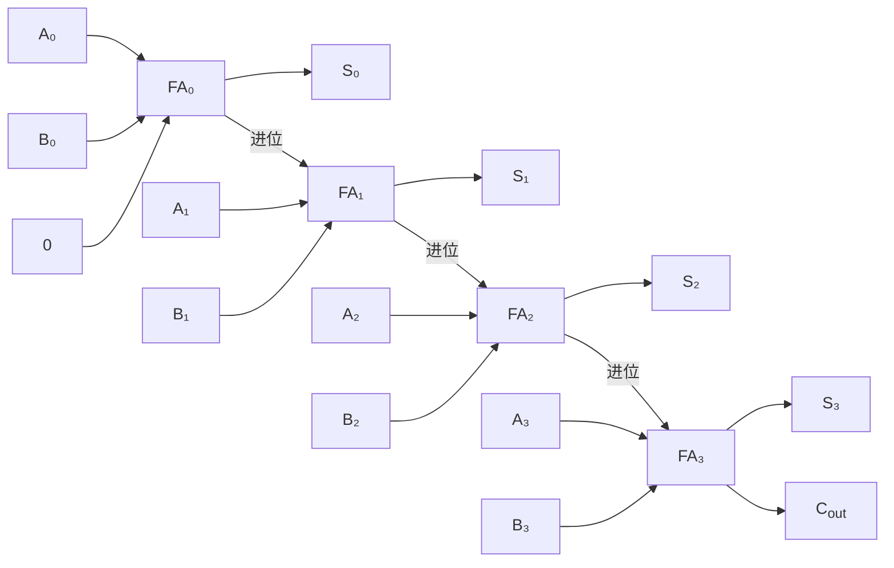

## 什么是全加器？

还记得半加器的局限吗？它只能加两个数，但实际计算中经常需要加**三个**——因为还有来自低位的进位。

还是用竖式来理解。计算二进制 $11 + 01$：

```
  1   1
+ 0   1
--------
```

从右往左算：
- **最低位（个位）**：1 + 1 = 0，进位 1 ✅ 半加器就能做
- **第二位**：1 + 0 + 进位(1) = ？这里有**三个数**要同时加。半加器做不了。

**全加器（Full Adder）** 就是为解决这个问题而生的——它多了一个**进位输入（Carry-in，Cin）**，可以处理三个位的加法。

## 真值表

A、B 是两个加数，Cin 是来自低位的进位：

| A | B | Cin | 和 (S) | 进位 (Cout) |
|---|---|-----|--------|-------------|
| 0 | 0 | 0   | 0      | 0           |
| 0 | 0 | 1   | 1      | 0           |
| 0 | 1 | 0   | 1      | 0           |
| 0 | 1 | 1   | 0      | 1           |
| 1 | 0 | 0   | 1      | 0           |
| 1 | 0 | 1   | 0      | 1           |
| 1 | 1 | 0   | 0      | 1           |
| 1 | 1 | 1   | 1      | 1           |

## 电路实现

全加器可以用**两个半加器 + 一个或门**巧妙地搭出来：



思路是这样的：
1. 先用一个半加器算 **A + B**，得到"中间和"和"进位 1"
2. 再用第二个半加器算 **中间和 + Cin**，得到"最终和"和"进位 2"
3. 只要"进位 1"或"进位 2"中有一个为 1，最终进位就是 1（用或门）

## 级联：接力赛式的多位加法

全加器的真正力量在于**级联**——像接力赛一样把多个全加器串起来，低位的进位输出传给高位的进位输入：



> 这就像接力赛跑：第一棒（FA₀）跑完把接力棒（进位）传给第二棒（FA₁），第二棒传给第三棒……N 个全加器串联就可以计算 N 位的二进制加法。

例如 8 个全加器串联 = 8 位加法器，可以计算 0~255 的加法。

## 小结

全加器通过增加"进位输入"解决了多位加法的进位传递问题。它是 CPU 中 [[alu|算术逻辑单元（ALU）]] 的核心计算部件——ALU 中的加法器就是由全加器级联构成的。接下来，我们将从"加法"走向"**记忆**"，学习另一种截然不同的电路——[[sr-latch|SR 锁存器]]。
