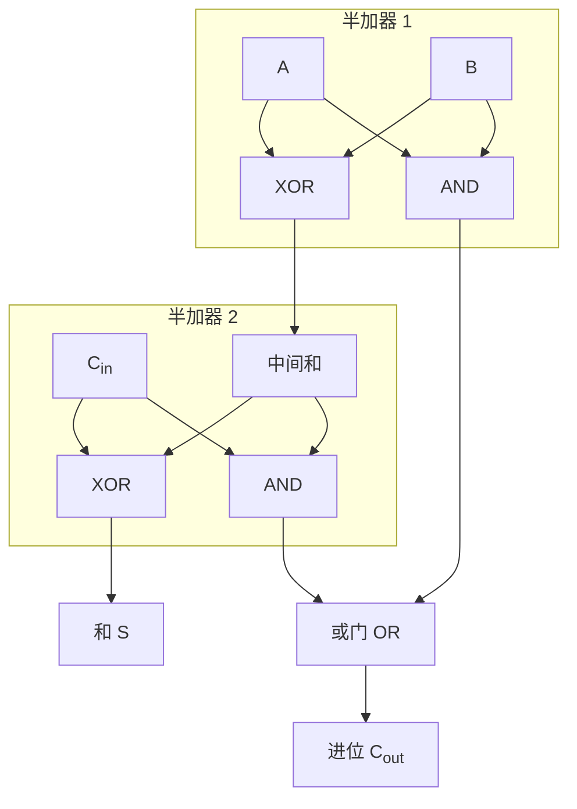
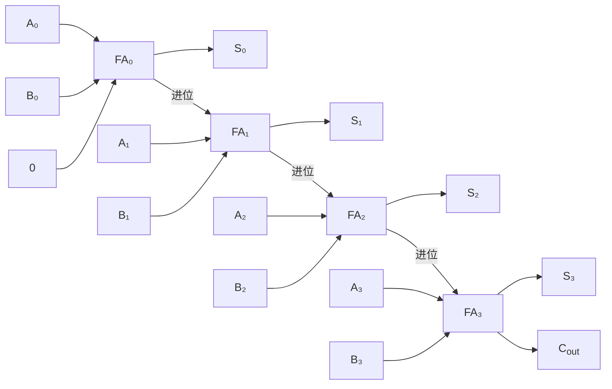

## 什么是全加器？

全加器（Full Adder）比 [[half-adder|半加器]] 多了一个**进位输入（Cin）**，可以处理来自低位的进位。它是构成多位加法器的基本单元。

## 真值表

| A | B | Cin | 和 (S) | 进位 (Cout) |
|---|---|-----|--------|-------------|
| 0 | 0 | 0   | 0      | 0           |
| 0 | 0 | 1   | 1      | 0           |
| 0 | 1 | 0   | 1      | 0           |
| 0 | 1 | 1   | 0      | 1           |
| 1 | 0 | 0   | 1      | 0           |
| 1 | 0 | 1   | 0      | 1           |
| 1 | 1 | 0   | 0      | 1           |
| 1 | 1 | 1   | 1      | 1           |

## 电路实现

全加器可以用**两个半加器 + 一个或门**实现：

## 级联：多位加法器

将多个全加器串联，低位的进位输出接到高位的进位输入，就构成了 **N 位加法器**：

例如，8 个全加器串联可以计算 8 位二进制加法（0~255）。

## 小结

全加器解决了带进位的二进制加法问题，是 CPU 中 ALU（算术逻辑单元）的核心组成部分。
