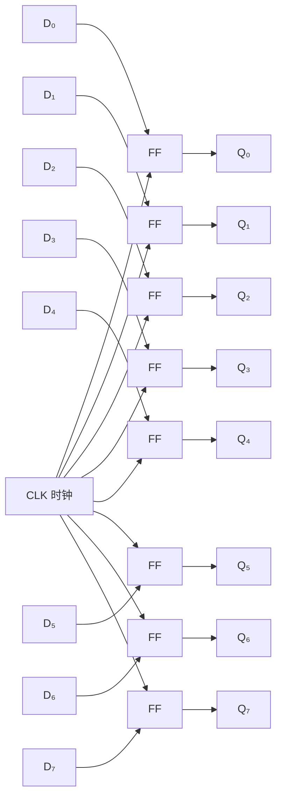

## 什么是寄存器？

**寄存器（Register）** 是 CPU 中最靠近运算单元的存储部件。一个寄存器由 **N 个 [[d-flipflop|D 触发器]] 并排组成**，每个触发器存储 1 位数据。

例如，一个 8 位寄存器由 8 个 D 触发器构成，可以存储 0~255 的数值。

## 寄存器结构

所有触发器共享同一个时钟信号，同时采样输入，同时更新输出。

## 寄存器的功能

- **存储数据**：保存计算过程中的中间值
- **暂存地址**：保存内存地址或 I/O 端口地址
- **移位操作**：寄存器中的位可以左移或右移

## CPU 中的常见寄存器

| 寄存器 | 名称 | 用途 |
|--------|------|------|
| PC | 程序计数器 | 存放下一条指令的内存地址 |
| IR | 指令寄存器 | 存放当前正在执行的指令 |
| ACC | 累加器 | 存放算术运算的结果 |
| SP | 栈指针 | 指向当前栈顶 |
| RA | 返回地址 | 存放函数调用的返回地址 |

## 寄存器 vs 内存

| 特性 | 寄存器 | 内存（RAM） |
|------|--------|------------|
| 速度 | 最快（1个时钟周期） | 较慢（几十到几百周期） |
| 容量 | 极小（几十到几百字节） | 大（GB级） |
| 价格 | 极高 | 较低 |
| 位置 | CPU 内部 | CPU 外部 |

## 寄存器在 CPU 中的角色

寄存器是 CPU 数据通路的枢纽：

1. 从内存读取指令到 IR（指令寄存器）
2. 从寄存器读取数据送到 ALU 计算
3. 计算结果写回寄存器（ACC）
4. PC 自动递增指向下一条指令

## 小结

寄存器是计算机中最快的存储部件。正是 D 触发器的同步特性，使得 CPU 中成亿的电路可以按照统一的时钟节拍有序工作。
