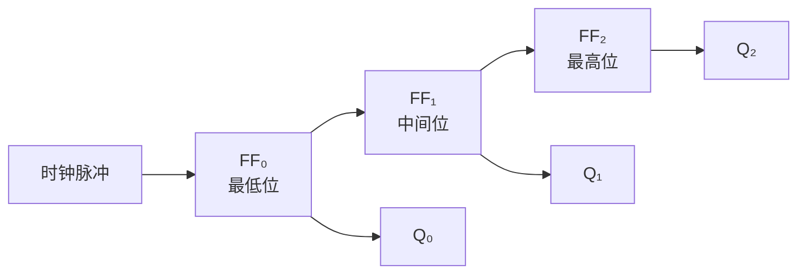
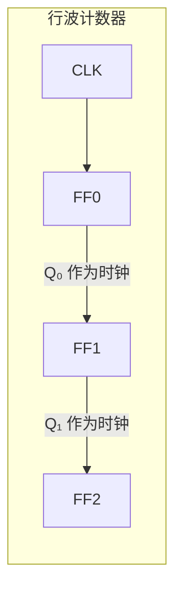
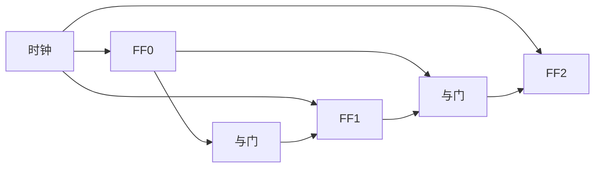

## 什么是计数器？

你有没有想过——你的运动手环是怎么知道你走了多少步的？机械手表为什么能精确计时？

它们的核心都是一个**计数器（Counter）**——一个能对脉冲个数进行计数的电路。

计数器是时序逻辑电路的重要应用。将多个 [[d-flipflop|D 触发器]] 级联，每个触发器的输出会随着时钟脉冲自动翻转，实现对脉冲个数的**二进制计数**。

计数器的本质是一个**累加记忆电路**——每来一个时钟脉冲，计数值加 1。

## 3 位二进制计数器

将 3 个 D 触发器级联，每个触发器的 **Q̅ 输出接回自己的 D 输入**（构成翻转模式），前一级的输出作为后一级的时钟：

> 🔄 **为什么会翻转？** 回忆一下 D 触发器的工作原理：D 输入的值会在时钟上升沿被保存到 Q。如果把 Q̅（Q 的反相）接到 D，那么当 Q=1 时，Q̅=0，下次时钟到来时 D=0，Q 就变成 0——这就实现了每次时钟触发时**自动翻转**。这种接法叫**T 触发器模式**（Toggle）。

当每个触发器的 D 端连接到自己的 Q̅ 时，每个时钟周期触发器都会翻转一次（T 触发器模式）。因此：

- **FF₀**：每个时钟翻转
- **FF₁**：Q₀ 从 1→0 时翻转
- **FF₂**：Q₁ 从 1→0 时翻转

### 计数序列

| 时钟脉冲 | Q₂ | Q₁ | Q₀ | 十进制值 |
|---------|----|----|----|---------|
| 0 | 0 | 0 | 0 | 0 |
| 1 | 0 | 0 | 1 | 1 |
| 2 | 0 | 1 | 0 | 2 |
| 3 | 0 | 1 | 1 | 3 |
| 4 | 1 | 0 | 0 | 4 |
| 5 | 1 | 0 | 1 | 5 |
| 6 | 1 | 1 | 0 | 6 |
| 7 | 1 | 1 | 1 | 7 |
| 8 | 0 | 0 | 0 | 0（归零） |

8 个时钟周期完成一个循环，这就是 **模 8 计数器**（3 位计数器）。

## 行波计数器

上面的电路叫**行波计数器（Ripple Counter）**——进位像波浪一样逐级传递。优点是电路简单，缺点是：

- 每级触发器有传播延迟（几十纳秒）
- 级数越多，总延迟越大
- 高频时可能出现计数错误

N 位行波计数器的最高工作频率受限于 N × 单级延迟。

## 同步计数器

**同步计数器（Synchronous Counter）** 所有触发器共享同一个时钟，用组合逻辑判断何时翻转：

- FF₀ 每个时钟翻转
- FF₁ 在 Q₀=1 时翻转
- FF₂ 在 Q₀=1 且 Q₁=1 时翻转

所有触发器**同时翻转**，没有级联延迟，适合高频应用。

## 分频器

计数器的另一个重要用途是**分频**：

- Q₀ 的频率是时钟的 **1/2**
- Q₁ 的频率是时钟的 **1/4**
- Q₂ 的频率是时钟的 **1/8**

这就是 [[d-flipflop|D 触发器]] 中提到的"分频器"应用——每个触发器将频率减半。

## 实际应用

- **程序计数器（PC）**：CPU 中的程序计数器本质上就是一个计数器，每执行一条指令自动加 1，指向下一条指令的地址
- **定时器**：对已知频率的时钟脉冲计数，实现精确的时间测量
- **频率计**：测量外部信号的频率
- **地址发生器**：按顺序访问内存地址

## 小结

计数器是触发器级联的典型应用。从行波计数器到同步计数器，体现了"用更多逻辑门换取更高速度"的工程设计思想。计数器与 [[register|寄存器]] 都是 CPU 中的重要基础部件。

接下来，我们将学习如何用寄存器阵列构建更大规模的存储结构——[[ram|随机存取存储器]]。
