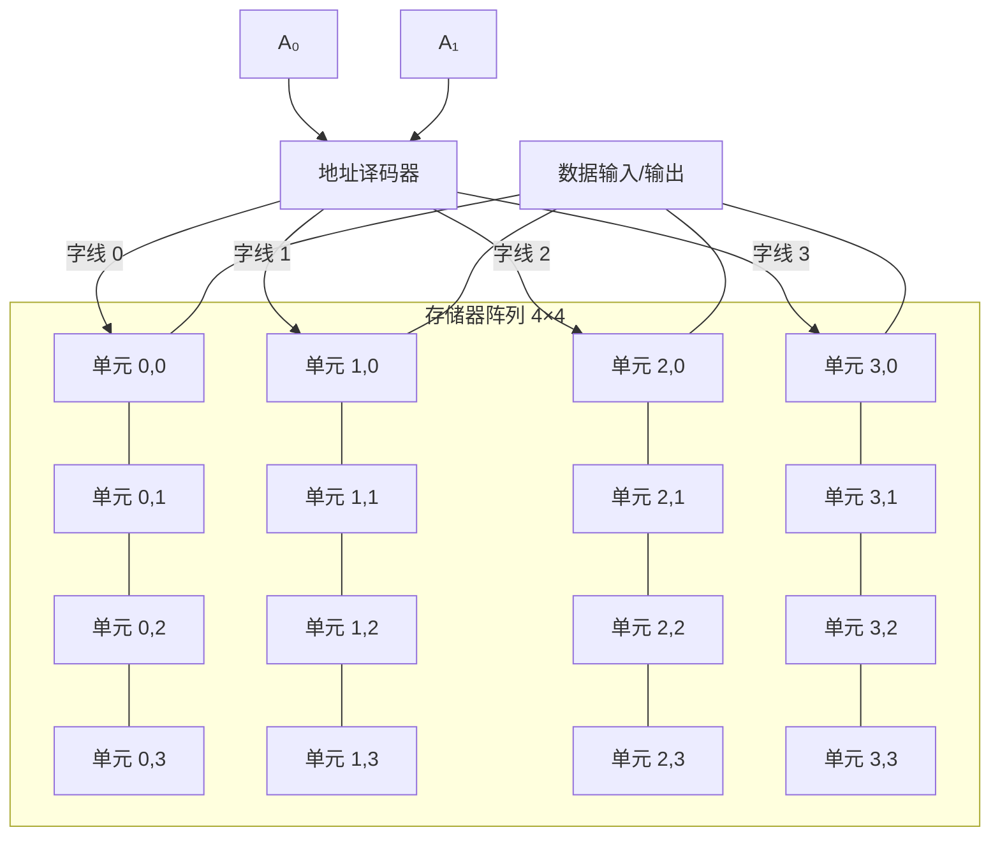

## 什么是 RAM？

**RAM（Random Access Memory，随机存取存储器）** 是计算机中用于**临时存储**数据和程序的主要存储介质。与 [[register|寄存器]] 相比，RAM 的容量大得多（GB 级），但速度较慢。

"随机存取"的含义是：访问任何一个存储单元的时间相同，与它的物理位置无关。

## 从寄存器到存储器阵列

一个 [[register|寄存器]] 存储 N 位数据，但存储容量有限。要扩大容量，需要将大量存储单元组织成**阵列**：

- **字线（Word Line）**：选择哪一行（哪个存储单元）
- **位线（Bit Line）**：读写被选中单元的数据



N 位地址可以寻址 $2^N$ 个存储单元。例如：
- 10 位地址 → 1024 个单元（1 KB）
- 20 位地址 → 1,048,576 个单元（1 MB）
- 32 位地址 → 约 43 亿个单元（4 GB）

## 地址译码器

**译码器（Decoder）** 将 N 位地址输入转换为 $2^N$ 条字线中的一条有效输出：

| A₁ | A₀ | 选中的字线 | 选中的单元 |
|----|----|-----------|-----------|
| 0 | 0 | 字线 0 | 第 0 行 |
| 0 | 1 | 字线 1 | 第 1 行 |
| 1 | 0 | 字线 2 | 第 2 行 |
| 1 | 1 | 字线 3 | 第 3 行 |

译码器的核心是与门阵列——每个与门检测一个特定的地址组合。

## SRAM 与 DRAM

### SRAM（静态 RAM）

- 每个存储单元由 **6 个晶体管** 组成（类似 [[sr-latch|SR 锁存器]] 结构）
- **速度快**，不需要刷新
- **容量小**，功耗较高
- 用于 **CPU 缓存**（Cache）

### DRAM（动态 RAM）

- 每个存储单元由 **1 个晶体管 + 1 个电容** 组成
- **速度较慢**，需要周期性刷新（电容会漏电）
- **容量大**，成本低
- 用于 **主存**（系统内存）

```mermaid
graph LR
    subgraph SRAM_Cell[SRAM 存储单元]
        T1[晶体管 1] --- T2[晶体管 2]
        T3[晶体管 3] --- T4[晶体管 4]
        T5[晶体管 5] --- BL[位线]
        T6[晶体管 6] --- BL̅[位线反]
    end

    subgraph DRAM_Cell[DRAM 存储单元]
        CAP[电容] --- TRANS[晶体管]
        TRANS --> DRAM_BL[位线]
    end
```

## 存储层次结构

现代计算机使用多级存储来解决"容量大、速度快、成本低"三者不可兼得的问题：

| 层级 | 容量 | 速度 | 技术 | 管理方式 |
|------|------|------|------|---------|
| 寄存器 | 几十字节 | ~0.3 ns | 触发器 | 编译器/程序 |
| L1 缓存 | 32~64 KB | ~1 ns | SRAM | 硬件自动 |
| L2 缓存 | 256~512 KB | ~5 ns | SRAM | 硬件自动 |
| L3 缓存 | 2~32 MB | ~15 ns | SRAM | 硬件自动 |
| 主存（RAM） | 4~64 GB | ~50 ns | DRAM | 操作系统 |
| 磁盘/SSD | 256 GB~2 TB | ~0.1 ms | 闪存/磁 | 操作系统 |

## 读写操作

RAM 的基本操作只有两种：

1. **读**：输入地址 → 译码器选中单元 → 数据从位线输出
2. **写**：输入地址 + 输入数据 → 译码器选中单元 → 数据写入存储单元

## 小结

RAM 将 [[register|寄存器]] 的存储能力扩展到了 GB 级别。地址译码器是 RAM 的核心组件——它用少量的地址线控制大量的存储单元。下一个知识节点将学习如何用逻辑门和加法器构建 CPU 的核心计算部件——[[alu|算术逻辑单元]]。
