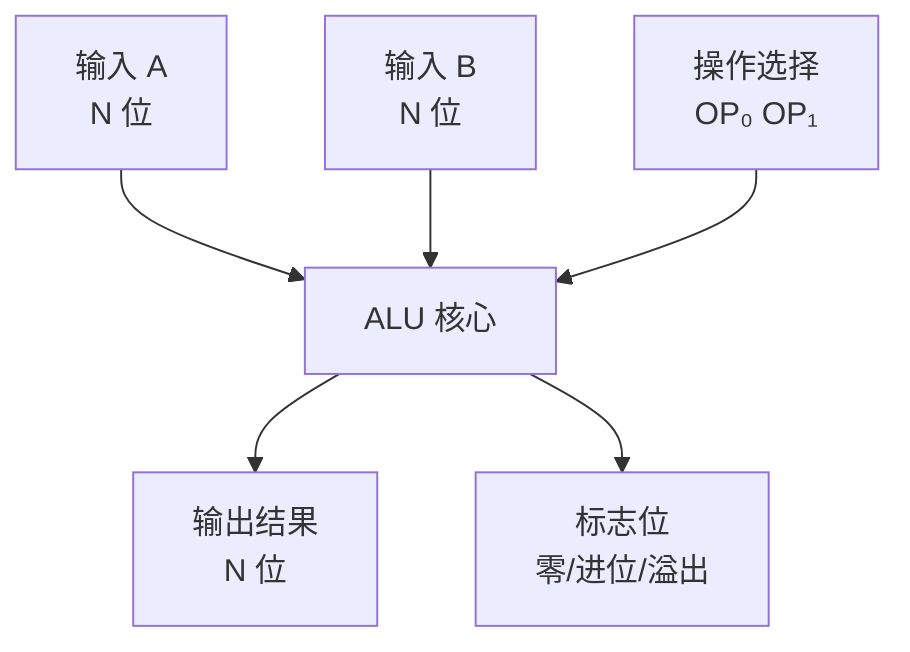
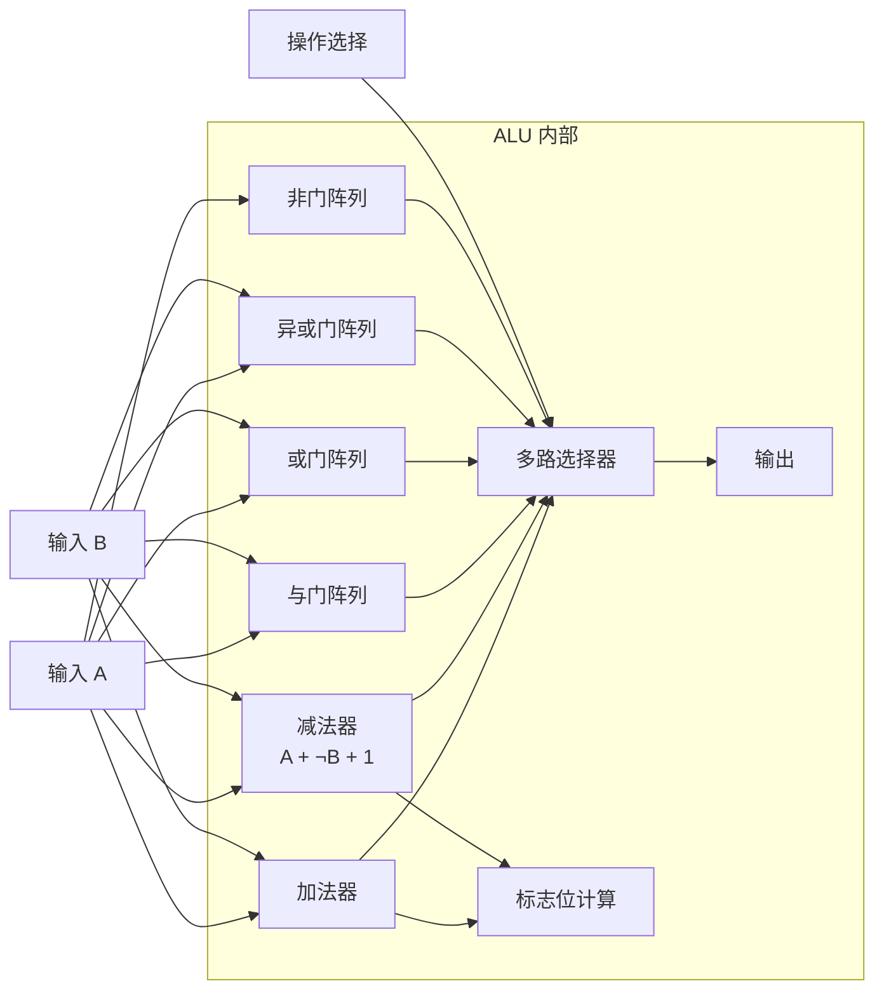

## 什么是 ALU？

**ALU（Arithmetic Logic Unit，算术逻辑单元）** 是 CPU 中负责**执行计算**的核心部件。它将之前学过的 [[full-adder|加法器]]、[[logic-gates|逻辑门]] 等电路组合成一个**可编程的计算单元**——通过控制信号选择执行哪种运算。

简单来说，ALU 就是计算机的"计算器"。

## ALU 结构概览

ALU 有两个 N 位输入（A 和 B），输出一个 N 位结果，同时产生若干**标志位**。

## 支持的运算

一个典型的 ALU 可以执行以下运算：

### 算术运算

| 操作 | 功能 | 说明 |
|------|------|------|
| ADD | A + B | 二进制加法 |
| SUB | A - B | 用补码实现（A + ¬B + 1）|
| INC | A + 1 | 递增 |
| DEC | A - 1 | 递减 |

### 逻辑运算

| 操作 | 功能 | 说明 |
|------|------|------|
| AND | A & B | 按位与 |
| OR | A \| B | 按位或 |
| XOR | A ⊕ B | 按位异或 |
| NOT | ~A | 按位取反 |

## 内部实现

ALU 内部将算术运算和逻辑运算分开计算，然后用**多路选择器**选出最终结果：

### 减法实现

减法用**补码加法**实现：

$$A - B = A + (\overline{B} + 1)$$

- 将 B 的所有位取反（用非门）
- 加 1（将进位输入设为 1）
- 用同一个加法器执行加法

这就是为什么 CPU 中**只需要加法器就能同时实现加减法**。

### 多路选择器

**多路选择器（Multiplexer，MUX）** 根据控制信号从多个输入中选一个输出：

- OP = 00 → 输出加法结果
- OP = 01 → 输出减法结果
- OP = 10 → 输出按位与
- OP = 11 → 输出按位或

## 标志位

ALU 除了输出计算结果，还会输出**标志位**反映运算状态：

| 标志 | 含义 | 判断条件 |
|------|------|---------|
| Z（零标志） | 结果是否为 0 | 所有输出位均为 0 |
| C（进位标志） | 是否产生进位 | 最高位有进位输出 |
| V（溢出标志） | 是否溢出 | 符号位进位与最高位进位不同 |
| N（负标志） | 结果是否为负 | 最高位（符号位）为 1 |

例如，计算 $0111_2 + 0001_2 = 1000_2$（7 + 1 = 8）：
- 对于 4 位有符号数，结果是 -8（溢出）
- V 标志置 1

## 小结

ALU 是 CPU 的计算核心。它将加法器、逻辑门、多路选择器等组合成一个多功能计算单元，通过控制信号灵活切换运算类型。标志位为后续的条件跳转和分支判断提供了基础。

至此，我们已经学习了从二进制到 ALU 的完整硬件知识链：二进制 → [[boolean-algebra|布尔代数]] → [[logic-gates|逻辑门]] → 加法器 → 触发器 → [[register|寄存器]] → [[ram|RAM]] → **ALU**。接下来，可以将这些部件组合成完整的 **CPU**。
