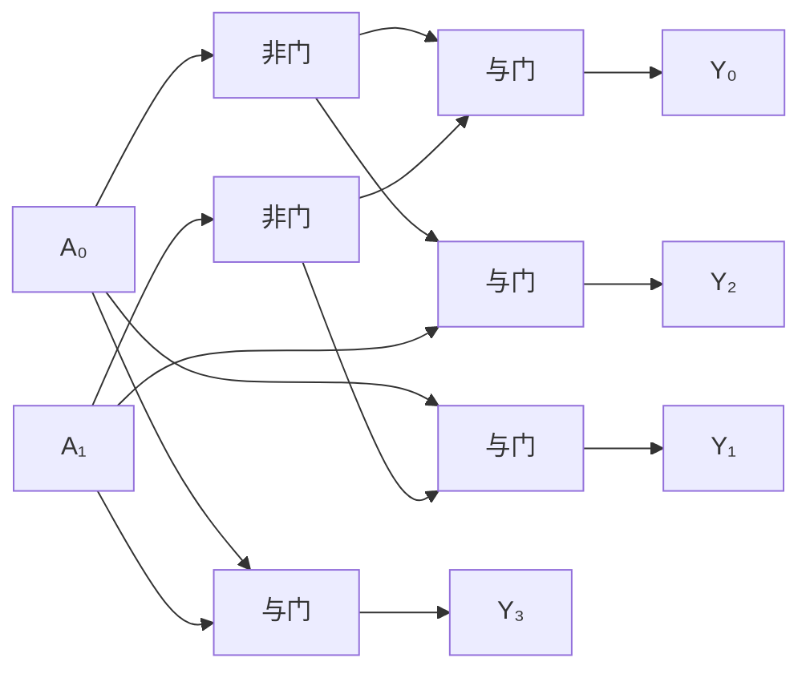
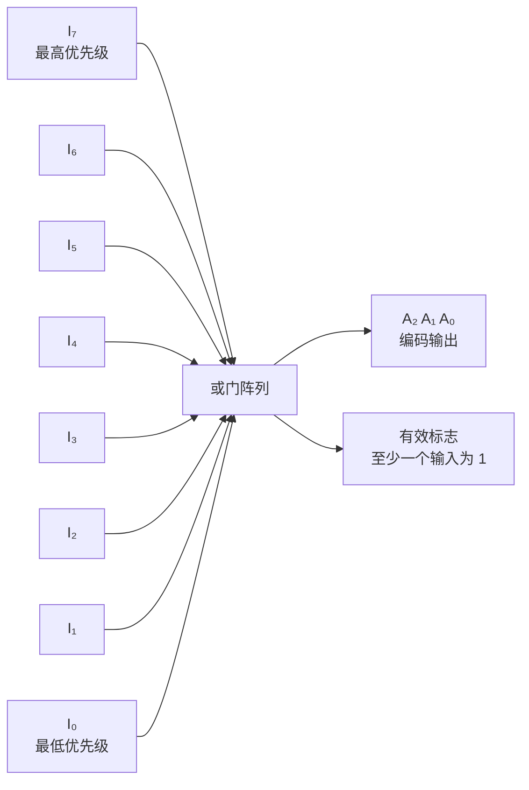

## 什么是译码器？

你在 ATM 机上按数字键——机器怎么知道你按的是"确认"而不是"取消"或"退出"？每个键对应一个独特的电信号，机器需要用电路**解析**这个信号，判断哪个键被按下。

**译码器（Decoder）** 就是做这件事的电路：它把 N 位二进制输入转换成 $2^N$ 条输出线中的**一条有效**。就像你用手指数数——伸出 2 根手指表示"第 2 个"。

它在 [[ram|RAM]] 中用于**地址译码**——将地址信号转换为选中某行存储单元的字线。

### 2-to-4 译码器

2 位输入，4 条输出线（每次只有一条输出为 1）：

| A₁ | A₀ | Y₃ | Y₂ | Y₁ | Y₀ | 选中的输出 |
|----|----|----|----|----|----|-----------|
| 0  | 0  | 0  | 0  | 0  | 1  | Y₀ |
| 0  | 1  | 0  | 0  | 1  | 0  | Y₁ |
| 1  | 0  | 0  | 1  | 0  | 0  | Y₂ |
| 1  | 1  | 1  | 0  | 0  | 0  | Y₃ |



**核心结构**：$2^N$ 个与门，每个与门检测一个特定的输入组合。输入用非门产生取反信号。

### 3-to-8 译码器

3 位输入，8 条输出。可以用两个 2-to-4 译码器级联构建：

```
       高位 A₂ = 0 → 使能上半部分 (Y₀~Y₃)
       高位 A₂ = 1 → 使能下半部分 (Y₄~Y₇)
```

## 七段数码管译码器

实际应用：将 4 位二进制数（0~9）转换为七段数码管的亮灭信号。

```
输入 0000 (0) → a,b,c,d,e,f 亮, g 灭 → 显示 "0"
输入 0001 (1) → b,c 亮 → 显示 "1"
输入 0010 (2) → a,b,d,e,g 亮 → 显示 "2"
```

7 个输出（a~g）各由一个组合逻辑电路控制，本质上是 4-to-7 的译码器。

## 什么是编码器？

**编码器（Encoder）** 是译码器的反向操作——$2^N$ 条输入线中有一条有效，输出其对应的 N 位二进制编码。

### 8-to-3 编码器

| I₇ | I₆ | I₅ | I₄ | I₃ | I₂ | I₁ | I₀ | A₂ | A₁ | A₀ |
|----|----|----|----|----|----|----|----|----|----|----|
| 0  | 0  | 0  | 0  | 0  | 0  | 0  | 1  | 0  | 0  | 0  |
| 0  | 0  | 0  | 0  | 0  | 0  | 1  | 0  | 0  | 0  | 1  |
| 0  | 0  | 0  | 0  | 0  | 1  | 0  | 0  | 0  | 1  | 0  |
| …  | …  | …  | …  | …  | …  | …  | …  | …  | …  | …  |
| 1  | 0  | 0  | 0  | 0  | 0  | 0  | 0  | 1  | 1  | 1  |

逻辑表达式：

- $A_0 = I_1 + I_3 + I_5 + I_7$
- $A_1 = I_2 + I_3 + I_6 + I_7$
- $A_2 = I_4 + I_5 + I_6 + I_7$

## 优先编码器

**优先编码器（Priority Encoder）** 解决多输入同时有效的问题——只编码**优先级最高**的输入。



例如 74HC148（8-to-3 优先编码器）：
- I₇ 优先级最高，I₀ 优先级最低
- 当 I₇ = 1 时，输出 111（忽略其他输入）
- 当 I₇ = 0, I₆ = 1 时，输出 110

## 实际应用

| 应用 | 组件 | 说明 |
|------|------|------|
| 内存地址译码 | 译码器 | CPU 发出的地址信号选择对应的存储单元 |
| 键盘扫描 | 优先编码器 | 多键按下时只响应优先级最高的键 |
| 七段数码管 | 译码器 | 将二进制数转换为数码管显示信号 |
| 中断控制器 | 优先编码器 | 多个中断请求同时到达时选择优先级最高的 |
| 指令译码 | 译码器 | CPU 中指令操作码的解析 |

## 小结

译码器和编码器是数字系统中"信号的翻译官"。译码器用于将地址或指令转换为控制信号，编码器用于将多个输入信号压缩为二进制编码。它们是构建 [[alu|ALU]]、[[ram|RAM]] 和 CPU 数据通路的关键基础部件。

接下来，我们将学习另一种重要的组合逻辑部件——[[multiplexer|多路选择器]]。
