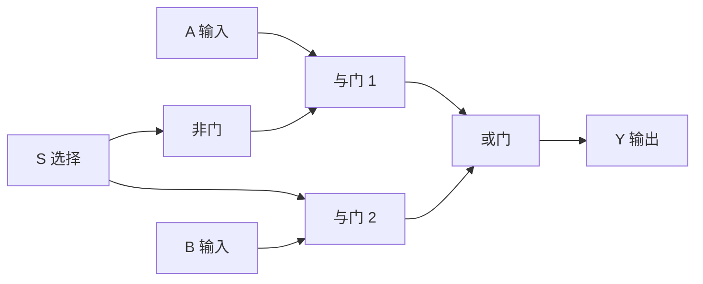
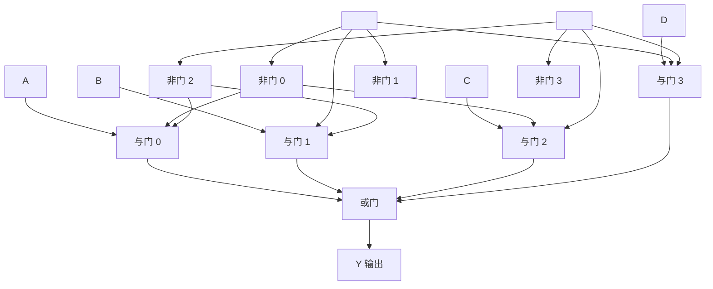
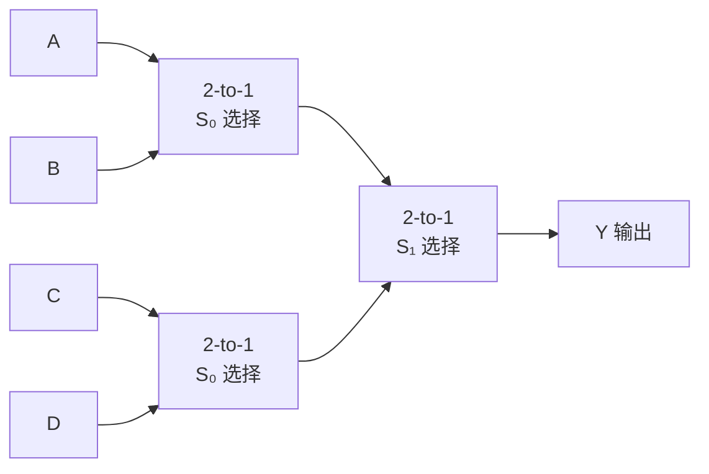

## 什么是多路选择器？

**多路选择器（Multiplexer，简称 MUX）** 根据选择信号从多个输入中选出**一个**输出。可以用一个开关来理解：

```
输入 0 ─╮
        ├──●── 输出（旋转开关选择哪一路输入接通）
输入 1 ─╯
```

对于数字电路，MUX 用组合逻辑实现——不需要机械开关。

## 2-to-1 MUX

最简单的 MUX：2 路输入，1 位选择信号 S。

| S | 输出 |
|---|------|
| 0 | Y = A |
| 1 | Y = B |

**逻辑表达式**：$Y = \overline{S} \cdot A + S \cdot B$



## 4-to-1 MUX

4 路输入，2 位选择信号 S₁S₀。

| S₁ | S₀ | 输出 |
|----|----|------|
| 0  | 0  | Y = A |
| 0  | 1  | Y = B |
| 1  | 0  | Y = C |
| 1  | 1  | Y = D |

**逻辑表达式**：$Y = \overline{S_1}\overline{S_0}A + \overline{S_1}S_0B + S_1\overline{S_0}C + S_1S_0D$



## MUX 的级联扩展

用 2-to-1 MUX 可以构建任意规模的 MUX。例如，4-to-1 MUX 可以用 3 个 2-to-1 MUX 构建：



## 应用：ALU 中的 MUX

在 [[alu|ALU]] 中，MUX 用于选择输出哪种运算结果：

```
加法器结果 ──╮
减法器结果 ──╠══  MUX  ══▶  ALU 输出
与运算结果 ──╣
或运算结果 ──╯
               ▲
               选择信号 OP₀ OP₁
```

ALU 操作选择可以看作一个 4-to-1 MUX：
- OP = 00 → 输出加法结果
- OP = 01 → 输出减法结果
- OP = 10 → 输出按位与
- OP = 11 → 输出按位或

## 实际应用

| 应用 | 说明 |
|------|------|
| 寄存器选择 | CPU 中多个寄存器共享一条数据总线，MUX 选择当前读哪个寄存器 |
| 数据通路 | 选择将 ALU 结果、内存数据或立即数写入寄存器 |
| 指令译码 | 不同指令使用 CPU 中不同的功能单元，MUX 路由数据 |
| 时分复用 | 通信系统中多路信号共享一条传输线路 |
| 函数发生器 | 用 MUX 实现任意组合逻辑（MUX 本质上是通用逻辑块） |

## MUX 与译码器的关系

[[decoder-encoder|译码器]] 和 MUX 都使用与门阵列结构，但功能相反：

- **译码器**：地址输入 → 选通一条输出（1-to-N 分配）
- **MUX**：选择信号 → 从多路输入中选一路输出（N-to-1 汇集）

两者配合可以实现数据选择、分配和路由的全部功能。

## 小结

多路选择器是数据通路的"闸门"——它决定了哪条数据线可以通行。从 ALU 操作选择到寄存器堆读取，MUX 是 CPU 中最常用的基本部件之一。其核心结构（与门 + 或门）体现了"与或式"组合逻辑的通用性。
