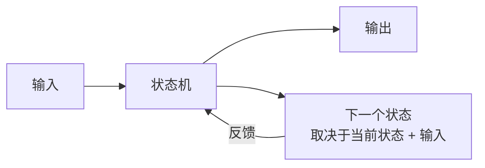
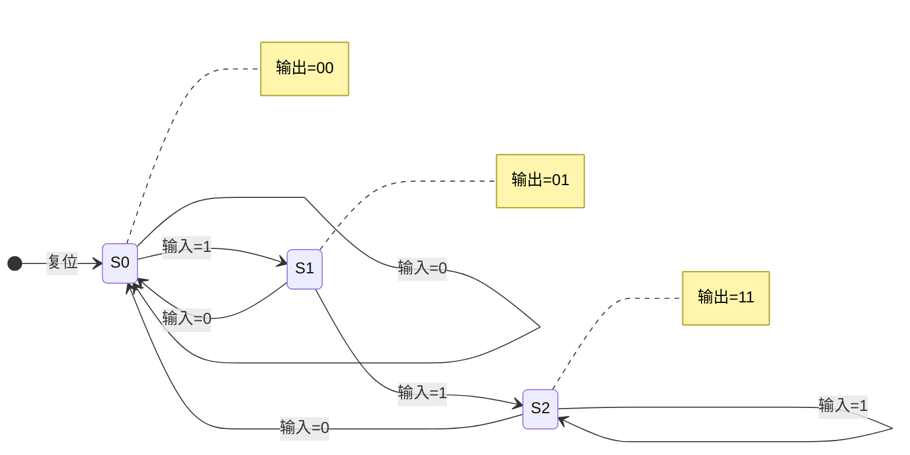
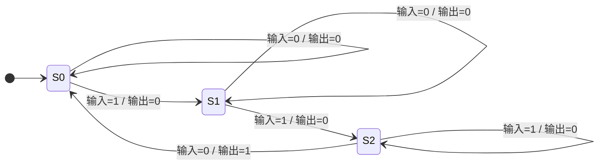
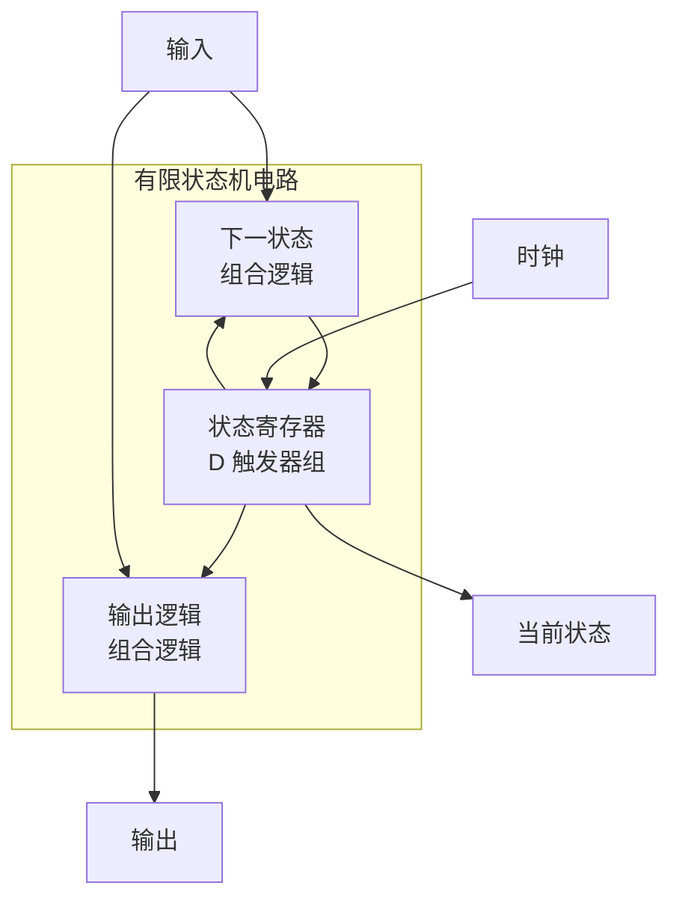
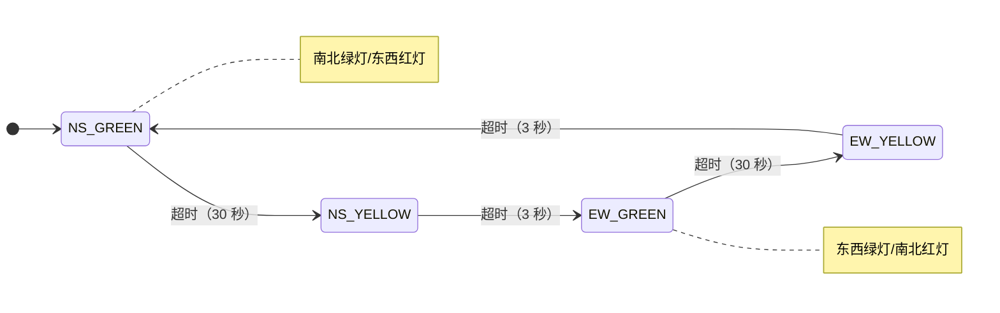

## 什么是状态机？

想象一台自动售货机：
1. 你投了 3 元钱，它处于"已投币 3 元"状态
2. 你点了 2.5 元的可乐，它切换到"出货中"状态
3. 可乐滚出来了，它回到"等待投币"状态

自动售货机在任何时刻都处于**有限个明确状态中的一个**。它会根据当前状态和你的操作（输入）决定下一步做什么——这就是**有限状态机**。

> 💡 其实 [[counter|计数器]] 就是状态机的一个特例：它的"状态"就是当前计数值，每次时钟脉冲就是"输入"，下一个状态就是计数值+1。

**有限状态机（Finite State Machine, FSM）** 是 [[d-flipflop|D 触发器]] 的推广：从能存储 1 位（2 个状态）扩展到能存储 N 位（$2^N$ 个状态）。所有时序逻辑电路——计数器、寄存器、CPU 控制器——本质上都是状态机。



## Moore 状态机

**Moore 型**：输出只取决于**当前状态**，与输入无关。



**特点**：
- 输出与输入**同步**（在状态稳定后输出才变化）
- 更安全，不会因输入毛刺导致输出异常
- 可能需要更多状态（输出信息编码在状态中）

## Mealy 状态机

**Mealy 型**：输出取决于**当前状态 + 当前输入**。



**特点**：
- 输出**立即响应**输入变化
- 通常用**更少的状态**实现相同功能
- 输入毛刺可能直接传递到输出

### Moore vs Mealy

| 特性 | Moore | Mealy |
|------|-------|-------|
| 输出依赖 | 仅当前状态 | 当前状态 + 输入 |
| 响应速度 | 滞后一个时钟 | 实时响应 |
| 状态数量 | 可能更多 | 通常更少 |
| 抗干扰 | 更强 | 较弱 |
| 典型用途 | 控制信号 | 数据传输 |

## FSM 的电路实现

状态机电路由三部分组成：



1. **状态寄存器**：N 个 D 触发器，存储当前状态（$2^N$ 个可能状态）
2. **下一状态逻辑**：组合逻辑（[[decoder-encoder|译码器]] + [[multiplexer|MUX]]），根据当前状态和输入计算下一状态
3. **输出逻辑**：组合逻辑（Moore 型只读状态，Mealy 型读状态 + 输入）

### 设计步骤

以"序列检测器"为例——检测到连续输入 "101" 时输出 1：

**Step 1**：画出状态图
```
S0（等待"1"）→ 收到 1 → S1
S1（收到"1"）→ 收到 0 → S2
S2（收到"10"）→ 收到 1 → S3（输出 1）
任何状态下收到意外输入 → 退回适当状态
```

**Step 2**：编写状态表

| 当前状态 | 输入=0 | 输入=1 | 输出 |
|---------|--------|--------|------|
| S0 | S0 | S1 | 0 |
| S1 | S2 | S1 | 0 |
| S2 | S0 | S3 | 0 |
| S3 | S2 | S1 | 1 |

**Step 3**：状态编码（例如 2 位二进制编码 S0=00, S1=01, S2=10, S3=11）

**Step 4**：设计下一状态组合逻辑（列出真值表，化简）

**Step 5**：用 D 触发器 + 门电路实现

## 应用：交通灯控制器

一个经典状态机例子——十字路口的交通灯：



- 4 个状态（南北绿灯、南北黄灯、东西绿灯、东西黄灯）
- 1 个输入（时钟超时信号）
- 6 个输出（南北/东西各 3 个灯）

## 实际应用

| 应用 | 状态数 | 说明 |
|------|--------|------|
| 交通灯控制 | 4~8 | 不同方向的绿灯、黄灯切换 |
| 电梯控制 | 取决于楼层 | 上升、下降、开门、关门 |
| CPU 控制器 | 数十个 | 指令取指→译码→执行→写回 |
| 串行通信（UART） | 16 | 波特率发生器、数据采样 |
| 数字密码锁 | 取决于密码长度 | 逐位验证密码 |
| 协议解析器 | 视协议而定 | I²C、SPI 等总线协议的状态序列 |

## 小结

有限状态机是数字系统设计的"最高纲领"——任何时序逻辑电路都可以用 FSM 来描述。从简单的计数器到复杂的 CPU 控制器，FSM 提供了统一的设计方法论。

FSM 也是组合逻辑（[[decoder-encoder|译码器]]、[[multiplexer|MUX]]）与时序逻辑（[[d-flipflop|触发器]]）的完美结合：触发器记忆状态，组合逻辑决定转移。至此，我们已经掌握了 CPU 的所有基本构建块。接下来，我们将学习如何将这些部件整合成完整的 **CPU**。
