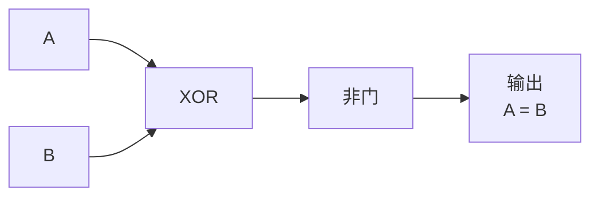
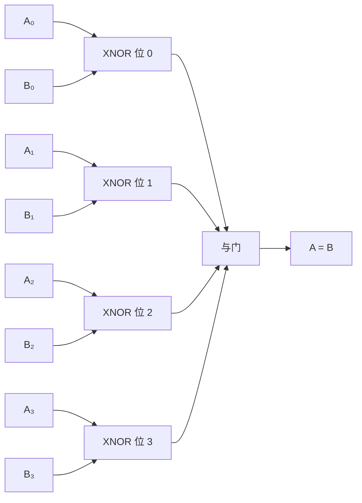

## 什么是比较器？

你在淘宝上搜商品时，可以按"价格从低到高"排序。这个排序靠的是什么？靠的是**比较**——判断两个数哪个大、哪个小、是否相等。

**比较器（Comparator）** 就是数字电路中用来做这件事的。它比较两个二进制数，输出它们的大小或相等关系。

## 1 位相等比较器

先看最简单的：比较两个**1 位**二进制数 A 和 B 是否相等。

真值表：

| A | B | A = B |
|---|---|-------|
| 0 | 0 | 1 |
| 0 | 1 | 0 |
| 1 | 0 | 0 |
| 1 | 1 | 1 |

你可能会认出来——这就是 **XNOR（异或非）** 门：A XNOR B = NOT (A XOR B)。两个输入相同则输出 1，不同则输出 0。

> 💡 **为什么不用简单的导线？** 你可能会想"A 和 B 连在一起，相等就输出 1 不就行了？"但问题是 A 和 B 是两个独立的信号——A=0,B=0 和 A=1,B=1 都是"相等"，不能简单地用一根导线判断。

## 1 位大小比较器

除了判断相等，有时还要知道哪个大。1 位比较器可以同时输出三种结果：

| A | B | A>B | A=B | A<B |
|---|---|-----|-----|-----|
| 0 | 0 | 0   | 1   | 0   |
| 0 | 1 | 0   | 0   | 1   |
| 1 | 0 | 1   | 0   | 0   |
| 1 | 1 | 0   | 1   | 0   |

逻辑表达式：
- **A>B** = A AND (NOT B)
- **A=B** = A XNOR B
- **A<B** = (NOT A) AND B

看，一个简单的与非门组合就实现了大小判断。

## N 位比较器

实际应用中很少只比较 1 位——通常是比较两个 N 位二进制数（比如两个 8 位数）。

### 相等判断

N 位相等判断非常简单：逐位比较，**所有位都相等**才输出 1。用与门把每位的 XNOR 结果连接起来即可。

### 大小判断

N 位大小比较器需要级联设计——从最高位开始比较：

1. 比较最高位（MSB）：如果 Aₙ > Bₙ，则 A > B，停止
2. 如果最高位相等，比较次高位
3. 以此类推，直到某一位分出大小，或所有位都相等

这个过程就像字典里比较两个单词——先比第一个字母，相同再比第二个，直到找到不同。

## 实际应用

| 应用 | 说明 |
|------|------|
| **排序** | 排序算法需要比较元素大小 |
| **条件分支** | CPU 中的条件判断（if-else）依赖比较器 |
| **地址匹配** | 缓存中判断地址是否命中 |
| **边界检查** | 判断一个数是否在有效范围内 |
| **密码验证** | 判断输入的密码是否与存储的密码相等 |

## 小结

比较器用基本的与或非门就能判断两个数的大小和相等关系。它是排序和条件判断的基础，在 CPU 的 [[alu|ALU]] 中也有重要应用（为标志位生成提供比较结果）。接下来，我们将学习另一种"存"的电路——比 D 触发器更强大的 [[jk-t-flipflop|JK 触发器与 T 触发器]]。
