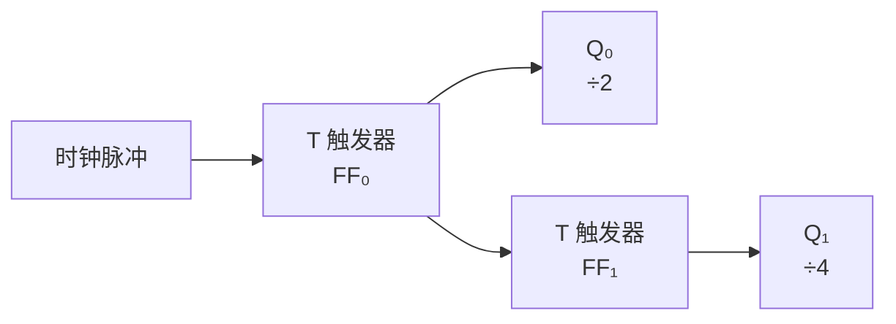

## 从 SR 到 JK

学了 [[sr-latch|SR 锁存器]] 和 [[d-flipflop|D 触发器]] 后，你可能觉得：D 触发器已经解决了 SR 锁存器的问题，为什么还需要其他触发器？

因为 D 触发器虽然解决了"无效状态"问题，但它也有局限——**你只能"置位"或"复位"，不能"翻转"**。所谓翻转，就是当前状态自动取反（Q 从 0 变 1 或从 1 变 0）。在 [[counter|计数器]] 中，我们用了 Q̅→D 的小技巧来实现翻转，但这不是 D 触发器的标准用法。

**JK 触发器（JK Flip-Flop）** 就是来解决这个问题的——它是功能最完善的触发器，**没有任何输入限制**。

## JK 触发器的功能

JK 触发器有两个输入：**J（Set）** 和 **K（Reset）**，比 SR 锁存器多了一个关键特性。

| J | K | Q 的下一个状态 |
|---|---|--------------|
| 0 | 0 | 保持不变 |
| 0 | 1 | 0（复位） |
| 1 | 0 | 1（置位） |
| 1 | 1 | **翻转** |

注意到区别了吗？当 J=1,K=1 时，JK 触发器**翻转**——Q 变成 Q̅。而在 SR 锁存器中，S=1,R=1 是"保持不变"（本应翻转的 S=0,R=0 是无效状态）。

> 为什么叫 J 和 K？这两个字母没有特定含义，只是为了区分 SR 锁存器的 S 和 R。这是发明者随意取的代号，一直沿用至今。

## 用 D 触发器理解 JK

JK 触发器的逻辑可以用一句话概括：

> **J = Set，K = Reset，J=K=1 = 翻转。**

它结合了 SR 锁存器的置位/复位能力和 D 触发器的无限制输入，还额外增加了翻转模式。

## T 触发器

**T 触发器（Toggle Flip-Flop）** 是 JK 触发器的特例——把 J 和 K 连在一起作为一个输入 T：

```mermaid
graph LR
    T[T] --> JK[JK 触发器<br>J = K = T]
    CLK[时钟] --> JK
    JK --> Q[Q]
    JK --> Q̅[Q̅]
```

| T | 功能 |
|---|------|
| 0 | 保持不变 |
| 1 | 翻转 |

> T 触发器只有一个输入，它的逻辑极其简单：T=1 时，每个时钟翻转一次。这就是 [[counter|计数器]] 中使用的"T 触发器模式"。实际上，之前讲的 D 触发器接 Q̅→D 就是用 D 触发器模拟了 T 触发器的行为。



T 触发器级联起来就是计数器——每个 T 触发器将频率除以 2。

## 四种触发器对比

| 类型 | 输入数 | 无效状态 | 翻转 | 特点 |
|------|--------|---------|------|------|
| **SR 锁存器** | S, R | ✅ S=R=1 | ❌ | 最基础，但有限制 |
| **D 触发器** | D | ❌ | ❌ | 最简单实用，广泛用于寄存器 |
| **JK 触发器** | J, K | ❌ | ✅ J=K=1 时翻转 | 功能最完善 |
| **T 触发器** | T | ❌ | ✅ T=1 时翻转 | 最简翻转，专为计数器设计 |

### 如何选型？

- **存储数据** → D 触发器（最简单，寄存器首选）
- **计数/分频** → T 触发器（接 T=1 即可）
- **需要灵活控制** → JK 触发器（功能最全）
- **简单锁存** → SR 锁存器（但注意无效状态）

## 小结

JK 触发器是 SR 锁存器的"完美进化版"——保留了置位/复位功能，消除了无效状态，还增加了翻转模式。T 触发器则是 JK 的极简版：J=K=T，只要 T=1 就每次时钟翻转一次。四种触发器各有适用场景，但 D 触发器和 T 触发器在实际工程中使用最广。接下来，我们将从"易失性存储"（RAM）走向"非易失性存储"——[[rom-flash|ROM 与闪存]]。
