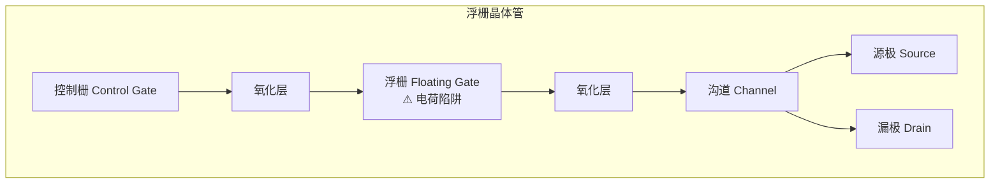
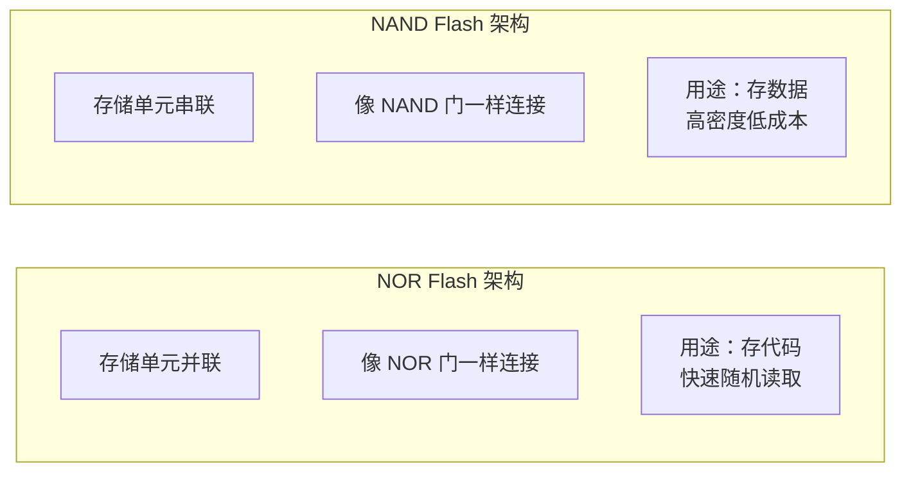

## 什么是只读存储器？

你关掉电脑再开机，发现操作系统还在、文件还在——但 [[ram|RAM]] 是断电就丢数据的，那这些信息存在哪？

答案是 **ROM（Read-Only Memory，只读存储器）** 和 **Flash（闪存）**。它们的特点正好和 RAM 相反：

> **RAM 是"工作台"——速度快但断电清空；ROM 是"保险柜"——速度慢但断电后数据还在。**

这种"断电不丢"的特性叫**非易失性（Non-Volatile）**。

## ROM 的发展史

### Mask ROM（掩膜 ROM）

最早的 ROM，在芯片制造时直接把数据"刻"进去。就像印刷好的书——内容固定，无法更改。

- ✅ 批量生产成本极低
- ❌ 无法修改，改一个 bit 就要重新做芯片

### PROM（可编程 ROM）

用户可以用专用设备"烧写"一次，之后就只读了。像一张空白光盘——刻了一次就不能改。

### EPROM（可擦除 PROM）

用紫外线照射芯片上的石英窗口，可以擦除数据重新编程。像可擦写的白板——用特殊"橡皮"擦掉重写。

### EEPROM（电可擦除 PROM）

用电信号擦除和重写，不需要紫外线。可以**按字节**修改，但速度慢。

## Flash 闪存

**Flash 闪存** 是 EEPROM 的进化版——它也是电可擦除的，但只能按"块"（Block）擦除，不能按字节。优点是**速度快、容量大、成本低**。

你的手机、U 盘、固态硬盘（SSD）用的都是 Flash。

### 浮栅晶体管

Flash 的核心是一个**浮栅晶体管**——在普通晶体管的控制栅和沟道之间多了一层"浮栅"：



- **写入**：在高电压下，电子穿过氧化层注入浮栅
- **读取**：浮栅中有电荷 → 晶体管导通阈值改变 → 检测到"0"
- **擦除**：用反向高电压把电子拉出浮栅

> 浮栅就像一个小桶——有电子表示"0"，没电子表示"1"。氧化层是完美的绝缘体，电子被关在桶里，断电也跑不掉。这就是非易失性的奥秘。

### NAND vs NOR Flash

Flash 有两种主流架构：

| 特性 | NOR Flash | NAND Flash |
|------|-----------|------------|
| 读取速度 | 快（随机访问） | 较慢（只能按页读） |
| 写入速度 | 慢 | 快 |
| 容量 | 小（~512MB） | 大（~1TB） |
| 成本 | 高 | 低 |
| 典型用途 | 代码存储（BIOS） | 数据存储（U盘、SSD） |



## 存储层次中的 ROM

在计算机的完整存储层次中，ROM/Flash 位于底部：

```
寄存器   →   L1缓存   →   L2缓存   →   RAM   →   SSD/Flash   →   机械硬盘
  ├── 速度最快 ────────── 速度最慢 →
  └── 容量最小 ────────── 容量最大 ─┘
           ↑ 易失性（断电丢） ↑        ↑ 非易失性（断电不丢） ↑
```

ROM 的典型用途：

- **BIOS/UEFI**：计算机开机时第一个执行的程序，存储在主板上的 Flash 中
- **固件（Firmware）**：路由器、手机、嵌入式设备的操作系统
- **SSD**：你的固态硬盘，本质上是 NAND Flash + 控制器芯片
- **U 盘**：便携式 NAND Flash

## 小结

ROM 和 Flash 为计算机提供了"断电不丢"的存储能力。从 Mask ROM 到 Flash 的发展史，就是存储技术不断追求"更大容量、更低成本、更快速度"的历史。Flash 中的浮栅晶体管是真正的创新——用一个"陷阱"困住电子，实现了非易失性。

至此，我们已经学完了硬件方向的全部基础存储技术：[[register|寄存器]] → [[ram|RAM]] → **ROM/Flash**。接下来，我们将把这些部件组合起来，构建完整的 [[finite-state-machine|CPU]]。
