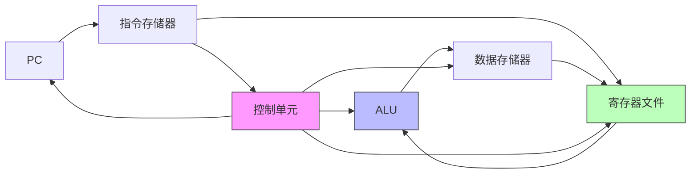
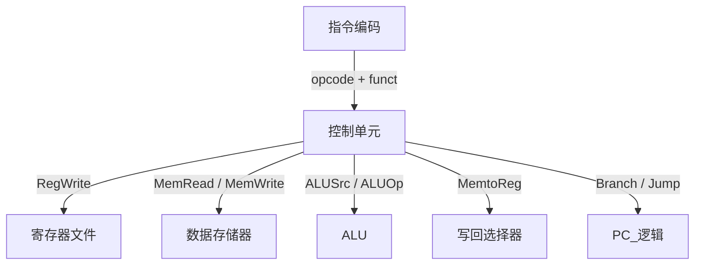

## CPU 执行一条指令，到底发生了什么？

你写 `a = b + c`，编译器把它变成 `ADD R0, R1, R2`。CPU 执行这条指令时，内部经历了：

1. 从内存取出指令（Fetch）
2. 解码指令含义（Decode）
3. 从寄存器读取操作数（Read）
4. 用 ALU 执行加法（Execute）
5. 把结果写回寄存器（WriteBack）

所有这些步骤，都发生在**数据通路（Datapath）**上——它是连接 CPU 各部件的"高速公路"。

### 类比：工厂生产流水线

- **数据通路** = 工厂里的传送带系统，连接各个工位
- **ALU** = 加工设备（切割、焊接）
- **寄存器** = 工位上的零件盒
- **内存** = 原材料仓库
- **时钟信号** = 工厂的节拍器，每个节拍往前推一步

## 数据通路的核心组成

```
                     ┌─────────────┐
                     │   PC（程序计数器）  │
                     └──────┬──────┘
                            │ 下一条指令地址
                            ↓
┌──────────────────────────────────────────┐
│               指令存储器                    │
│           （Instruction Memory）          │
└────────────────┬─────────────────────────┘
                 │ 指令
                 ↓
┌──────────────────────────────────────────┐
│              控制单元                      │
│     解码指令，产生控制信号                   │
└──┬──┬──┬──┬──┬──┬──┬──┬──┬──┬──┬────────┘
   │  │  │  │  │  │  │  │  │  │  │
   ↓  ↓  ↓  ↓  ↓  ↓  ↓  ↓  ↓  ↓  ↓
   控制信号（RegWrite, MemRead, ALUOp...）
                    │
                    ↓
┌──────────────────────────────────────────┐
│              寄存器文件（Register File）    │
│  ┌─────┐ ┌─────┐ ┌─────┐ ┌─────┐        │
│  │ R0  │ │ R1  │ │ R2  │ │ R3  │ ...    │
│  └─────┘ └─────┘ └─────┘ └─────┘        │
└──────────┬───────────────────────────────┘
           │ 操作数
           ↓
     ┌─────────┐
     │  ALU    │
     └────┬────┘
          │ 结果
          ↓
┌──────────────────────────────────────────┐
│             数据存储器                     │
│          （Data Memory）                  │
└──────────────────────────────────────────┘
```

### PC（程序计数器）

PC（Program Counter，程序计数器）保存当前指令的地址。每条指令执行后，PC 自动增加（通常是 +4，因为 32 位指令占 4 字节）：

```
初始：PC = 0x1000
取指：读取 0x1000 处的指令
执行：PC = PC + 4 = 0x1004（准备取下一条）
```

> 🔑 PC 是 CPU 状态的"指挥棒"——[[branch-jump-instructions|分支指令]]的本质就是修改 PC，而 [[interrupts-exceptions|中断]] 则是强制修改 PC。

### 寄存器文件（Register File）

寄存器文件是 CPU 内部的一组高速存储单元：

```
寄存器文件（以 32 个 32 位寄存器为例）：
             读端口 1      读端口 2
              ↑              ↑
地址1 ──────→│              │← 地址2
             │  寄存器文件   │
结果 ───────→│              │← 写入地址
             写端口
```

- **读端口**：同时读取两个寄存器的值（如 ADD R0, R1, R2 需要读 R1 和 R2）
- **写端口**：写入计算结果

### ALU

[[alu|ALU]] 执行实际的算术和逻辑运算。

### 数据存储器

即内存（RAM），用于读取和存储数据。指令 `LOAD R0, [addr]` 从这里读取，`STORE [addr], R0` 向这里写入。

## 单周期数据通路

最简单的 CPU 设计——每条指令在一个时钟周期内完成所有步骤：



### ADD 指令的执行路径

```
指令：ADD R1, R2, R3    （R1 = R2 + R3）

步骤 1（取指）：PC → 指令存储器 → 获取指令编码
步骤 2（解码）：控制单元解码 → 产生控制信号
步骤 3（读寄存器）：R2, R3 → ALU 输入
步骤 4（执行）：ALU 计算 R2 + R3 → 结果
步骤 5（写回）：结果 → R1

整个过程中，控制信号保持不变：
- RegWrite = 1（要写寄存器）
- ALUSrc = 0（ALU 第二个输入来自寄存器）
- ALUOp = ADD（加法运算）
- MemRead = 0（不读内存）
- MemWrite = 0（不写内存）
- MemtoReg = 0（写到寄存器的数据来自 ALU）
```

### LOAD 指令的执行路径

```
指令：LOAD R1, [R2+offset]    （从内存地址 R2+offset 读取到 R1）

步骤 1（取指）：PC → 指令存储器
步骤 2（解码）：控制单元解码
步骤 3（读寄存器）：R2 → ALU 输入
步骤 4（计算地址）：ALU 计算 R2 + offset → 内存地址
步骤 5（读内存）：数据存储器[地址] → 数据
步骤 6（写回）：数据 → R1

控制信号区别：
- ALUSrc = 1（第二个 ALU 输入来自指令中的立即数偏移）
- ALUOp = ADD（计算地址）
- MemRead = 1（要读内存）
- MemtoReg = 1（写到寄存器的数据来自内存）
```

### STORE 指令的执行路径

```
指令：STORE [R2+offset], R1    （把 R1 的值写入内存 R2+offset）

步骤 1（取指）：PC → 指令存储器
步骤 2（解码）：控制单元解码
步骤 3（读寄存器）：R2 → ALU 输入（地址），R1 → 数据存储器输入
步骤 4（计算地址）：ALU 计算 R2 + offset
步骤 5（写内存）：数据存储器[地址] = R1

控制信号区别：
- RegWrite = 0（不写寄存器）
- MemWrite = 1（要写内存）
```

## 不同指令在数据通路上的差异

| 指令类型 | 读寄存器? | 用 ALU? | 读写内存? | 写寄存器? |
|---------|---------|---------|----------|----------|
| **R-type**（ADD, SUB, AND...） | ✅ 读 2 个 | ✅ 运算 | ❌ | ✅ |
| **I-type**（ADDI, LOAD...） | ✅ 读 1 个 | ✅ 运算或算地址 | LOAD ✅/STORE ✅ | LOAD ✅/R-type ✅ |
| **STORE** | ✅ 读 2 个 | ✅ 算地址 | ✅ 写 | ❌ |
| **BEQ**（条件分支） | ✅ 读 2 个 | ✅ 比较 | ❌ | ❌ |
| **JMP**（无条件跳转） | ❌ | ❌ | ❌ | ❌ |

> 🔑 控制单元的核心工作就是根据指令类型，**配置数据通路上的各个开关**，让数据走不同的路径。

## 时钟与同步

CPU 的所有操作都由**时钟信号**同步：

```
时钟周期：
   ┌───┐   ┌───┐   ┌───┐   ┌───┐
──┘   └───┘   └───┘   └───┘   └───
    ↑     ↑     ↑     ↑     ↑
  时钟上升沿——所有触发器同时采样
```

单周期 CPU 中，一个时钟周期完成一条指令的全部操作：

```
时钟周期 1       时钟周期 2       时钟周期 3
◄──────────────►◄──────────────►◄──────────────►
 取指→解码→执行    取指→解码→执行    取指→解码→执行
  指令 1           指令 2           指令 3
```

> ⚠️ 单周期设计的时钟周期由最慢的指令（通常是 LOAD，需要走遍取指→解码→地址计算→读内存→写回）决定——其他指令即使更快，也得等同一个时钟长度。

这就是为什么现代 CPU 改用**流水线**——不同指令的不同步骤可以重叠执行（详见 [[instruction-pipeline|指令流水线]]）。

## 数据通路的控制信号

每条指令通过**控制信号线**来配置数据通路：

| 控制信号 | 作用 | 取值 |
|---------|------|------|
| **RegWrite** | 是否写寄存器 | 0 / 1 |
| **ALUSrc** | ALU 第二输入来源 | 0=寄存器 / 1=立即数 |
| **ALUOp** | ALU 执行什么操作 | ADD, SUB, AND, OR... |
| **MemRead** | 是否读内存 | 0 / 1 |
| **MemWrite** | 是否写内存 | 0 / 1 |
| **MemtoReg** | 写回寄存器的数据来源 | 0=ALU / 1=内存 |
| **Branch** | 是否为分支指令 | 0 / 1 |
| **PCWrite** | 是否修改 PC | 0 / 1 |



## 数据通路的局限性

单周期数据通路的设计虽然清晰，但有明显的性能问题：

| 问题 | 原因 |
|------|------|
| **时钟周期由最慢指令决定** | LOAD 指令走的路最长（取指→解码→ALU→内存→写回），其他指令跟着被拖慢 |
| **硬件浪费** | 每条指令只用了部分硬件（比如 ALU 运算时存储器闲着） |
| **无法克服物理距离** | 信号要在 CPU 内穿越多个部件，时钟频率受限于最长路径 |

这些局限性推动了下两个重要的架构演进：
1. **多周期 CPU**：一条指令分多步执行，每步一个时钟周期——时钟频率可以更高
2. **流水线**（主流方案）：多条指令的不同步骤重叠执行——见 [[instruction-pipeline|指令流水线]]

## 小结

数据通路是 CPU 的"骨架"——它把各个组件连接在一起，让数据按照指令的要求流动：

| 组件 | 角色 |
|------|------|
| **PC（程序计数器）** | 指向当前指令 |
| **指令存储器** | 存放程序 |
| **寄存器文件** | CPU 内部的高速暂存 |
| **ALU** | 执行计算 |
| **数据存储器** | 存放数据 |
| **控制单元** | 指挥数据如何流动 |

**核心流程**（所有指令都遵循）：
```
取指（Fetch）→ 解码（Decode）→ 执行（Execute）→ 访存（Memory）→ 写回（WriteBack）
```

**为什么这很重要？** 数据通路揭示了 CPU 执行指令的物理真实——不是"CPU 自动执行"，而是数据在特定路径上流过各个组件，由时钟信号同步，由控制信号引导。理解了数据通路，你就理解了 CPU 工作的底层画面。

接下来，你将学习数据通路的"指挥中心"——控制单元如何根据指令编码产生正确的控制信号（此内容将在后续章节详细讲解）。
