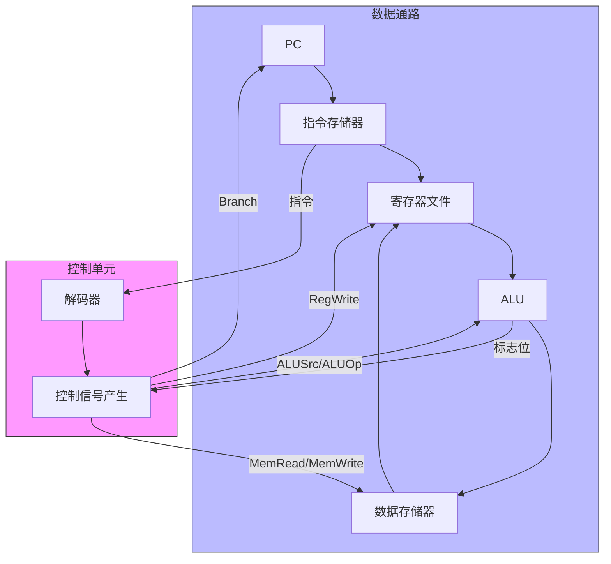

## CPU 的"指挥中心"

[[cpu-datapath|数据通路]] 是 CPU 的"硬件骨架"，但谁来控制数据往哪走？谁决定 ALU 做加法还是减法？谁决定什么时候写寄存器？

**控制单元（Control Unit）** 就是做这些决定的——它读取指令的操作码，生成一系列控制信号，指挥数据通路上每一个部件。

### 类比：乐谱与指挥家

- **指令** = 乐谱上的音符
- **控制单元** = 指挥家——看到乐谱，告诉每个乐器什么时候演奏、以什么方式演奏
- **数据通路** = 乐团——在指挥家的引导下演奏各自的乐器
- **控制信号** = 指挥家的手势——具体的动作指令

没有控制单元，数据通路只是一堆乱七八糟的连线——有了它，它们才能协同工作。

## 指令解码

控制单元的第一步是**搞清楚当前指令是什么**。

### 指令格式

一条 RISC 指令通常被分成几个字段：

```
31      25  24      20  19      15  14    12  11        7  6       0
┌──────────┬──────────┬──────────┬─────────┬────────────┬──────────┐
│  opcode  │   rd     │   rs1    │ funct3  │    rs2     │  funct7  │
│  7 位    │  5 位    │  5 位    │  3 位   │   5 位     │  7 位    │
└──────────┴──────────┴──────────┴─────────┴────────────┴──────────┘
```

| 字段 | 含义 |
|------|------|
| **opcode**（操作码） | 指令大类（算术、访存、分支...） |
| **rd** | 目标寄存器（结果写到哪里） |
| **rs1, rs2** | 源寄存器（操作数从哪里来） |
| **funct3 / funct7** | 功能码，进一步指定具体操作 |
| **immediate** | 立即数（不同类型指令位置不同） |

### 解码过程

控制单元只关心**指令类型**，根据它来设置控制信号：

```c
// 简化的解码逻辑
switch (opcode) {
    case R_TYPE:   // 寄存器-寄存器运算（ADD, SUB, AND...）
        reg_write = 1;
        alu_src = 0;      // ALU 第二操作数来自寄存器
        mem_read = 0;
        mem_write = 0;
        mem_to_reg = 0;   // 写回数据来自 ALU
        alu_op = decode_funct(funct3, funct7);  // 由 funct 决定具体运算
        break;

    case I_TYPE:   // 立即数运算 / LOAD
        reg_write = 1;
        alu_src = 1;      // ALU 第二操作数来自立即数
        if (opcode == LOAD) {
            mem_read = 1;
            mem_to_reg = 1;  // 写回数据来自内存
        } else {
            mem_read = 0;
            mem_to_reg = 0;
        }
        break;

    case S_TYPE:   // STORE
        reg_write = 0;     // 不写寄存器
        mem_write = 1;
        alu_src = 1;
        break;

    case B_TYPE:   // 分支（BEQ, BNE...）
        reg_write = 0;
        alu_op = SUB;      // 用减法来比较
        branch = 1;
        break;
}
```

## 控制信号的产生

控制单元本质上是一个**组合逻辑电路**——输入指令编码，输出控制信号：

```
输入（32 位指令）：
┌──────────────────────────────────────┐
│ opcode │  rd  │  rs1  │ ...          │
└──────────────────────────────────────┘
                    ↓
           ┌────────────────┐
           │   控制单元      │
           │ 组合逻辑电路    │
           └──────┬─────────┘
                    ↓
输出（控制信号）：
┌─────┬────┬─────┬────┬─────┬────┬────┐
│RegW │MemR│MemW │ALUS│MemR│ALUO│Br  │
│rite │ead │rite │rc  │eg  │p   │anch│
└─────┴────┴─────┴────┴─────┴────┴────┘
```

### 用真值表描述控制信号

```
输入 opcode → 输出控制信号

opcode      | RegWrite | ALUSrc | MemRead | MemWrite | MemtoReg | Branch
────────────┼──────────┼────────┼─────────┼──────────┼──────────┼───────
R-type      |    1     |   0    |    0    |    0     |    0     |   0
LOAD        |    1     |   1    |    1    |    0     |    1     |   0
STORE       |    0     |   1    |    0    |    1     |    x     |   0
BEQ         |    0     |   0    |    0    |    0     |    x     |   1
```

每条控制信号线本质上就是一个**布尔函数**——可以用 [[logic-gates|逻辑门]] 实现：

```
RegWrite = (opcode == R_TYPE) OR (opcode == LOAD) OR (opcode == I_TYPE)
ALUSrc   = (opcode == LOAD) OR (opcode == STORE) OR (opcode == I_TYPE)
MemRead  = (opcode == LOAD)
...
```

## 硬布线控制 vs 微程序控制

### 硬布线控制（Hardwired Control）

控制单元直接用逻辑门电路实现——输入 opcode，输出就是控制信号。

```
                       opcode
                         │
          ┌───┬──┬──┬──┬┴┬──┬──┬──┐
          │   │  │  │  │  │  │  │  │
          └───┴──┴──┴──┴──┴──┴──┴──┘
            │   │              │   │
          ┌─▼─┐ │            ┌─▼─┐ │
          │AND│ │            │AND│ │
          └───┘ │            └───┘ │
            │   │              │   │
            └───┼──────┬───────┼───┘
                │    ┌─▼─┐    │
                │    │OR │    │
                │    └───┘    │
                ▼             ▼
           RegWrite        ALUSrc
```

| 方面 | 硬布线控制 |
|------|-----------|
| **速度** | ⚡ 极快（纯硬件，几纳秒） |
| **复杂度** | 指令越多，电路越复杂 |
| **可扩展** | ❌ 修改指令集需要重新设计电路 |
| **适用** | RISC（指令少而规整） |

### 微程序控制（Microprogrammed Control）

控制指令"存储"在一个小的 ROM 里——每条机器指令对应一段**微程序**（microcode），控制单元读取并执行这些微程序：

```
                    opcode
                      │
                      ↓
        ┌──────────────────────┐
        │   控制存储器（ROM）    │
        │  ┌──────────────────┐│
        │  │ R-type: RegWr←1 ││
        │  │         ALUSrc←0││
        │  │         ...     ││
        │  ├──────────────────┤│
        │  │ LOAD:  RegWr←1 ││
        │  │         ALUSrc←1││
        │  │         MemRd←1││
        │  │         ...     ││
        │  └──────────────────┘│
        └──────────────────────┘
                    │
                    ↓
              控制信号
```

| 方面 | 微程序控制 |
|------|-----------|
| **速度** | 🐢 较慢（多一步 ROM 读取） |
| **灵活性** | ✅ 修改指令集只需更新 ROM |
| **可扩展** | ✅ 添加新指令就是加一段微码 |
| **适用** | CISC（指令多而复杂） |

> 💡 x86 CPU 内部实际上是 **CISC 指令 → 微程序解码 → RISC 核心执行**——x86 指令在硬件层面上被翻译成更简单的内部微操作，再由底层的 RISC 风格流水线执行。这就是为什么现代 x86 CPU 能同时兼容大量旧指令又保持高性能。

## 控制单元的输入

控制单元不仅要看 opcode，还需要其他输入来做出完整决策：

```
控制单元输入：
┌──────────────────────────────────────────┐
│  指令编码 ──→ 确定指令类型和操作           │
│  Zero 信号 ──→ ALU 输出是否为 0（用于 BEQ）│
│  （更多标志位 ──→ 条件分支需要）            │
└──────────────────────────────────────────┘
```

### 标志位的作用

[[flags-condition-codes|标志位]]（Zero, Carry, Overflow, Sign）是 ALU 运算的"副产品"，控制单元利用它们做条件判断：

```asm
BEQ R1, R2, label   ; 如果 R1 == R2 就跳转
```

控制单元的处理：
1. 解码出这是一条 BEQ（条件分支）指令
2. 设置 ALU 执行 R1 - R2
3. 读取 ALU 的 Zero 标志
4. Zero = 1 → 修改 PC（跳转）
5. Zero = 0 → PC = PC + 4（继续）

## 数据通路与控制单元的交互

完整的 CPU 内部结构：



### 闭环：指令控制通路，通路执行指令

```
① 指令从内存取出
    ↓
② 控制单元解码指令
    ↓
③ 控制单元设置数据通路（控制信号）
    ↓
④ 数据通路执行操作（寄存器读→ALU→内存→写回）
    ↓
⑤ PC 更新，取下一条指令
    ↓
⑥ 回到 ①
```

## 实际例子：R-type 指令的执行

以 `ADD X1, X2, X3`（X1 = X2 + X3）为例，跟踪控制信号：

```
指令编码（RISC-V 32 位格式）：
0000000_00011_00010_000_00001_0110011
↑       ↑     ↑     ↑   ↑      ↑
funct7  rs2   rs1   f3  rd    opcode
(0000000)(X3) (X2)(ADD)(X1)  (R-type)

控制单元解码：
opcode = 0110011 → R-type 算术运算
funct3 = 000, funct7 = 0000000 → ADD 操作

产生的 控制信号：
RegWrite = 1    ← 需要把结果写回 X1
ALUSrc   = 0    ← ALU 的第二输入来自 rs2（X3），不是立即数
ALUOp   = ADD  ← ALU 执行加法
MemRead  = 0    ← 不访问数据存储器
MemWrite = 0    ← 不写数据存储器
MemtoReg = 0    ← 写回数据来自 ALU 结果

数据通路执行：
1. 读寄存器：X2 → ALU 输入 A, X3 → ALU 输入 B
2. ALU 计算：A + B = X2 + X3
3. 结果写回：X1 ← 结果
```

## 控制单元的局限与演进

| 挑战 | 说明 | 解决方式 |
|------|------|---------|
| **解码延迟** | 复杂指令解码时间长 | 预解码（pre-decode）、缓存解码结果 |
| **功耗** | 控制逻辑占 CPU 功耗的相当比例 | 简化指令集、优化解码器设计 |
| **分支预测** | 控制单元需要预测分支方向 | 增加分支预测器（见流水线章节） |
| **乱序执行** | 指令不按顺序执行时控制更复杂 | 增加保留站（reservation station）、重排序缓冲 |

## 小结

控制单元是 CPU 的"大脑"——它让数据通路不再是杂乱无章的电路，而是能执行任意程序的通用计算引擎：

| 概念 | 要点 |
|------|------|
| **指令解码** | 从 opcode + funct 字段判断指令类型 |
| **控制信号** | 一组布尔信号，指挥数据通路各部件的操作 |
| **硬布线控制** | 逻辑门直接实现，快但不易扩展 |
| **微程序控制** | ROM 存微码，灵活但稍慢 |
| **标志位反馈** | ALU 的 Zero/Overflow 等标志影响控制决策 |

**为什么这很重要？** 控制单元是连接"软件"和"硬件"的桥梁——指令是软件层面的概念（我们写 ADD、LOAD），但控制单元把这些符号翻译成具体的硬件控制信号。理解控制单元，你就理解了指令集架构（ISA）在硬件层面的实现。

接下来，你将看到控制单元和数据通路如何通过流水线技术大幅提升性能——让多条指令同时执行（此内容将在后续章节详细讲解）。
