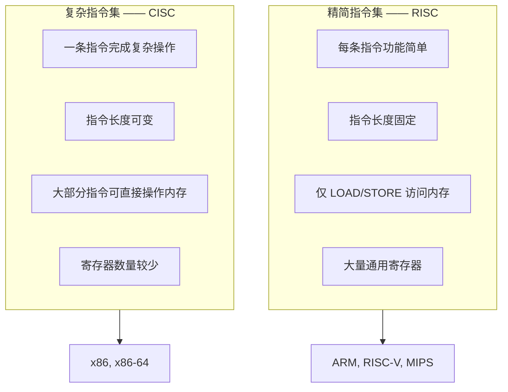

## 什么是 ISA？

[[machine-code|机器码]]的格式因 CPU 而异——Intel CPU 和 ARM CPU 听不懂对方的指令。这就像一个人说中文、一个人说英语，互相不理解。

**ISA（Instruction Set Architecture，指令集架构）** 就是定义 CPU"语言"的完整规范：

- CPU 能执行哪些指令（指令集）
- 有多少个寄存器、每个多大
- 内存如何组织、如何访问
- 数据格式（整数、浮点数的表示方式）

> ISA 是**软件和硬件之间的契约**：只要软件遵守这个契约（使用该 ISA 的指令），任何实现了该 ISA 的 CPU 都能运行它。

### 类比：国际象棋的规则

- **ISA** = 国际象棋的规则（马走日、象走田、王车易位）
- **CPU 实现** = 你的实体棋盘（木头做的、塑料做的、磁吸的——规则一样就能下）
- **软件** = 棋谱（按规则走的每一步）

同一个棋谱（软件）可以在不同的棋盘（不同厂商的 CPU）上走，只要它们遵循同一套规则（ISA）。Intel 的 Core i9 和 AMD 的 Ryzen 都实现 x86-64 ISA，所以同一份 Windows 程序可以在两种 CPU 上运行。

## ISA 的组成部分

一个完整的 ISA 规范包含以下四个要素：

### 1. 寄存器

寄存器是 CPU 内部的高速"便签本"，用来暂存数据。不同的 ISA 有不同数量和类型的寄存器：

| ISA | 通用寄存器数量 | 特点 |
|-----|--------------|------|
| x86-64 | 16 个（64 位） | 部分寄存器有特殊用途（如 RSP 是栈指针） |
| ARM64 | 31 个（64 位） | 数量多，编译器更灵活 |
| RISC-V | 32 个（32/64 位） | 设计极简，对称通用 |

### 2. 指令集

指令通常分为几大类：

| 类别 | 示例 | 说明 |
|------|------|------|
| 数据传送 | MOV, LOAD, STORE | 在寄存器和内存间移动数据 |
| 算术运算 | ADD, SUB, MUL | 加减乘除 |
| 逻辑运算 | AND, OR, XOR, NOT | 位运算 |
| 控制转移 | JMP, BEQ, CALL, RET | 跳转、条件分支、函数调用 |
| 系统指令 | INT, HLT, ECALL | 中断、停机、系统调用 |

### 3. 寻址方式

指定操作数位置的方法——这个话题将在 [[addressing-modes|寻址方式]] 中详细展开。

### 4. 内存模型

- **字节寻址**：每个字节有唯一的内存地址（几乎所有现代 CPU 都如此）
- **对齐要求**：某些 ISA 要求 4 字节整数必须放在 4 的倍数地址上
- **大小端**：多字节数据在内存中按什么顺序排列

## RISC vs CISC

ISA 设计哲学的两大阵营：

### 类比：乐高 vs 宜家

- **RISC（精简指令集）** = 乐高积木。每个积木很小、很简单（一块 2×4 的砖），但你可以用很多积木搭出任何东西。CPU 设计简单、省电、容易提高频率。手机芯片几乎全是 RISC。

- **CISC（复杂指令集）** = 宜家家具的组装步骤。一条指令可能等于"把整面墙装好"——功能强大但指令复杂。CPU 需要更复杂的解码电路，但写程序更方便（一条指令顶好几条 RISC 指令）。

> 💡 **现代趋势**：CISC 外表下的 RISC 核心。x86 CPU 内部将复杂指令拆解为多个**微操作（micro-ops）**，再交给 RISC 风格的核心执行。这样既兼容了海量 x86 软件，又享受了 RISC 的高效执行。

## 主流 ISA 一览

| ISA | 诞生 | 设计哲学 | 特点 | 主要用于 |
|-----|------|---------|------|---------|
| x86 / x86-64 | Intel, 1978 | CISC | 向后兼容 40+ 年，生态庞大 | 桌面、服务器 |
| ARM / ARM64 | ARM, 1985 | RISC | 低功耗，性能出色 | 手机、平板、嵌入式 |
| RISC-V | UC Berkeley, 2010 | RISC | 开源免费，模块化可扩展 | 教学、新兴硬件 |
| MIPS | MIPS, 1981 | RISC | 教学经典，商业上已衰退 | 已逐渐淘汰 |

### 聊聊 RISC-V：为什么它特别？

RISC-V 是近年来最受关注的 ISA，原因只有一个：**它完全开源**。

- x86 和 ARM 都是**闭源**的——想设计一款兼容它们的 CPU，需要支付高昂的授权费
- RISC-V 采用**开源许可**，任何人都可以免费设计自己的 RISC-V CPU
- 这让它在中国芯片产业中备受关注——可以实现 CPU 设计的自主可控

> 🏫 另外，RISC-V 也是目前**计算机体系结构教学的首选 ISA**，因为它的指令格式极其简洁优雅（基础指令只有不到 50 条），非常适合初学者学习。

## 为什么 ISA 重要？

1. **二进制兼容性**：同一 ISA 的不同实现可以运行相同软件——你的手机应用能在不同品牌的 ARM 芯片上跑
2. **生态锁定**：一旦软件生态建立（如 Windows on x86），更换 ISA 极为困难——这是 x86 统治 PC 领域 40 年的根本原因
3. **硬件/软件分工**：ISA 划清了"硬件该做什么"和"软件该做什么"的边界，让两者可以独立发展

## 小结

ISA 是计算机体系结构的基石——它定义了 CPU 能理解的"语言"和软件运行的"平台"。不同 ISA（x86、ARM、RISC-V）代表了不同的设计哲学（CISC vs RISC）。理解了 ISA，你就明白了为什么手机软件不能在电脑上直接运行、为什么国产芯片要走 RISC-V 路线。

接下来，一个更具体的问题：**指令如何指定数据的位置？** 是直接写在指令里？存在寄存器中？还是藏在内存的某个角落？[[addressing-modes|寻址方式]] 将为你解答。
