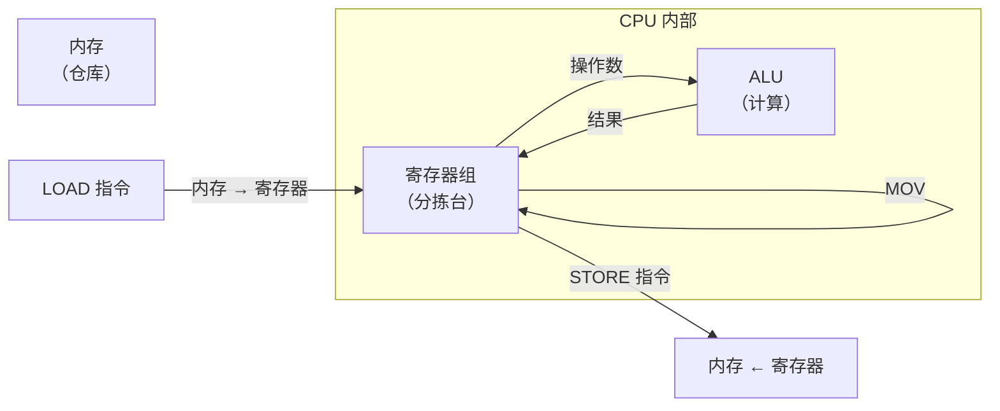

## 计算机的"搬砖"工作

CPU 要做计算，前提是数据必须在正确的位置——要么在 [[alu|ALU]] 的输入端，要么在寄存器中。但数据最初存在内存里怎么办？算完的结果要存回内存又怎么办？

这就引出了汇编中最基本的一类指令：**数据传送指令**。

> 计算机大部分时间不是在"计算"，而是在"搬数据"——从内存搬到寄存器，从一个寄存器搬到另一个寄存器，再从寄存器搬回内存。你写的每一行高级语言代码，最终都会变成多条数据传送指令。

### 类比：快递分拣站

想象一个快递分拣站：

- **内存** = 巨大的仓库，存放所有包裹（数据）
- **寄存器** = 分拣台上的暂存区，只能放少量包裹
- **MOV / LOAD / STORE** = 搬运工

包裹（数据）必须先拿到分拣台（寄存器）才能处理。处理完再放回仓库（内存）。**没有任何操作能绕过这个流程。**

## MOV 指令——寄存器之间的数据传送

`MOV` 是最基本的数据传送指令，负责在**寄存器之间**或**寄存器与立即数之间**复制数据。

### 寄存器 ↔ 寄存器

```asm
MOV R1, R2   ; 把 R2 的值复制到 R1（R2 保持不变）
MOV R3, R1   ; 把 R1 的值复制到 R3
```

```
R1 = 未知       R1 = 42
R2 = 42   ──→  R2 = 42  ← R2 不变！
执行 MOV R1, R2 之后
```

> ⚠️ `MOV R1, R2` 是**复制**不是"移动"——R2 的值不会消失。就像你复印一份文件，原件还在。

### 寄存器 ↔ 立即数

```asm
MOV R1, #100    ; 把立即数 100 存入 R1
MOV R2, #0xFF   ; 把十六进制数 FF（= 255）存入 R2
```

```
指令: MOV R1, #100
              │
              ▼
┌──────┐  ┌───────┐
│ 指令中 │  │ R1 =  │
│ 的 100 │─→│ 100   │
└──────┘  └───────┘
```

这里的 `#` 是立即数前缀——在 [[addressing-modes|寻址方式]] 中我们学过，这叫**立即寻址**。

### 不同 ISA 的不同命名

同一个"从寄存器复制到寄存器"的操作，在不同 ISA 中有不同名字：

| ISA | 指令示例 | 含义 |
|-----|---------|------|
| x86 | `MOV EAX, EBX` | 将 EBX 复制到 EAX |
| ARM | `MOV R0, R1` | 将 R1 复制到 R0 |
| RISC-V | `ADD R1, R2, R0` | RISC-V 甚至没有专用的 MOV——用 `ADD` + 常数 0 实现 |

> 💡 RISC-V 没有 MOV 指令：`ADD R1, R2, R0` 等价于 `R1 = R2 + 0` = 复制 R2 到 R1。这就是 RISC 设计哲学的体现——用最少的指令组合出所有功能。

## Load 和 Store——内存与寄存器之间的数据传送

寄存器数量有限（通常 16~32 个），而内存有 GB 级别——数据需要在两者之间来回搬运。

在 **Load/Store 架构** 中：

| 方向 | 指令类型 | 含义 |
|------|---------|------|
| 内存 → 寄存器 | **LOAD** | 从内存**加载**到寄存器 |
| 寄存器 → 内存 | **STORE** | 从寄存器**存储**到内存 |

### 不同 ISA 的不同写法

```asm
; ─── x86 风格：内存操作融入普通指令 ───
MOV EAX, [1000]     ; 从内存 1000 加载到 EAX（相当于 LOAD）
MOV [2000], EAX     ; 把 EAX 存入内存 2000（相当于 STORE）

; ─── ARM 风格：明确区分 LOAD / STORE ───
LDR R1, [R2]        ; Load Register：从 R2 指向的内存读取到 R1
STR R1, [R2]        ; Store Register：把 R1 写入 R2 指向的内存

; ─── RISC-V 风格：LW / SW ───
LW R1, 0(R2)        ; Load Word：从 R2+0 读 4 字节到 R1
SW R1, 4(R2)        ; Store Word：把 R1 写 4 字节到 R2+4
```

### 完整的数据流动



## 实战：计算数组元素之和

用数据传送指令 + [[addressing-modes|寄存器间接寻址]] 实现一个完整的程序：

```asm
; 数组从内存地址 1000 开始，有 4 个整数（每个 4 字节）
; 目标：计算这 4 个数的和，存入 R5

MOV R1, #1000        ; R1 = 数组起始地址
MOV R5, #0           ; R5 = 累加器，初始化为 0

LOAD R2, [R1]        ; R2 = 第一个数（地址 1000）
ADD R5, R5, R2       ; R5 += 第一个数

ADD R1, R1, #4       ; 地址后移 4 字节
LOAD R2, [R1]        ; R2 = 第二个数（地址 1004）
ADD R5, R5, R2       ; R5 += 第二个数

ADD R1, R1, #4
LOAD R2, [R1]        ; R2 = 第三个数（地址 1008）
ADD R5, R5, R2

ADD R1, R1, #4
LOAD R2, [R1]        ; R2 = 第四个数（地址 1012）
ADD R5, R5, R2       ; R5 = 最终结果

STORE R5, [2000]     ; 把结果存入内存地址 2000
```

```
内存布局：
地址         数据
1000      ┌─────────┐
          │  数1    │  ← LOAD [R1]
1004      ├─────────┤
          │  数2    │  ← LOAD [R1+4]
1008      ├─────────┤
          │  数3    │
1012      ├─────────┤
          │  数4    │
          └─────────┘

... ...

2000      ┌─────────┐
          │  结果    │  ← STORE R5, [2000]
          └─────────┘
```

> 🔍 注意到规律了吗？`LOAD R2, [R1]` → `ADD R5, R5, R2` → `ADD R1, R1, #4` 这个三步模式重复了 4 次。这正是循环的雏形——后续要学的分支与跳转指令可以帮我们消除这些重复代码。

## 必须牢记的"坑"

### 1. 内存↔内存不能直接传

大多数 ISA 不允许一条指令直接从内存搬到内存：

```asm
; ❌ 错误（大多数 ISA 不允许）
MOV [1000], [2000]

; ✅ 正确做法：分两步
LOAD R1, [2000]       ; 第一步：内存 → 寄存器
STORE R1, [1000]      ; 第二步：寄存器 → 内存
```

这是 **Load/Store 架构** 的核心约束：只有 LOAD 和 STORE 能访问内存，其他指令只能在寄存器上操作。

### 2. 大小端问题

多字节数据在内存中的排列方式有两种：

```asm
; 存储 0x12345678 到地址 1000

; 大端（Big Endian）：高位字节在低地址
; 地址 1000: 12    1001: 34    1002: 56    1003: 78

; 小端（Little Endian）：低位字节在低地址
; 地址 1000: 78    1001: 56    1002: 34    1003: 12
```

> x86 使用小端，ARM 可配置大小端，RISC-V 固定小端。网络协议（如 TCP/IP）通常使用大端。这就是为什么你在写网络程序时要调用 `htonl()` 进行字节序转换。

### 3. 对齐访问

某些硬件要求数据必须"对齐"——2 字节数据在偶数地址，4 字节数据在 4 的倍数地址：

```asm
; 假设 R1 = 1001（奇数地址）
LOAD R2, [R1]         ; 可能触发"未对齐访问异常"！
```

违反对齐要求可能导致程序崩溃或性能下降（CPU 需要两次内存访问才能拼出完整数据）。

## 实际运用：C 赋值语句的底层映射

```c
// C 语言中看似简单的赋值
int x = 42;
int y = x;
```

在汇编层面，每一行都对应具体的数据传送指令：

```asm
; int x = 42;
    MOV R0, #42        ; 立即数 → 寄存器（立即寻址）
    STORE R0, [addr_x] ; 寄存器 → 内存（直接寻址）

; int y = x;
    LOAD R1, [addr_x]  ; 内存 → 寄存器（直接寻址）
    STORE R1, [addr_y] ; 寄存器 → 内存（直接寻址）
```

**C 语言的一条赋值语句 = 汇编的 2-3 条数据传送指令。** 这就是为什么说"计算机大部分时间不是在计算，而是在搬数据"。

## 小结

数据传送指令是汇编编程的"基本功"——计算机大部分时间都在搬数据。三种基本操作：

| 指令类型 | 方向 | 用途 |
|---------|------|------|
| MOV | 寄存器↔寄存器/立即数 | CPU 内部搬数据 |
| LOAD | 内存→寄存器 | 把数据加载到 CPU |
| STORE | 寄存器→内存 | 把结果存回内存 |

掌握了数据传送指令，你已经可以编写简单的汇编程序了——把数据从内存搬到寄存器、做些计算、再把结果存回去。接下来，你将学习如何让 CPU 真正"算起来"——算术与逻辑指令（此内容将在后续章节详细讲解）。
