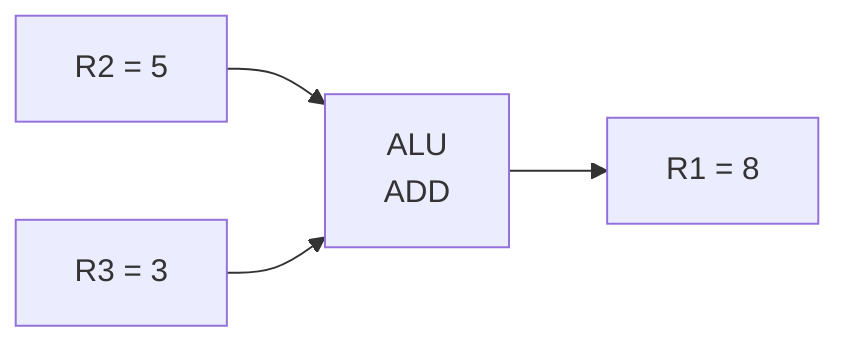

## 从搬数据到算数据

前几节你学会了用 [[data-transfer-instructions|MOV/Load/Store]] 在寄存器和内存之间搬数据。但搬来搬去是为了什么？——**为了算。**

`A = B + C * 2` 这样的表达式，在底层全靠算术和逻辑指令一条条算出来。这些指令直接驱动 [[alu|ALU]] 硬件干活。

### 类比：计算器的不同按键

你桌上的计算器有各种按键：
- `+` `−` `×` `÷` 是**算术运算**
- `AND` `OR` `XOR` 是**逻辑运算**（高级计算器才有）
- `=` 后的显示就是运算结果

CPU 的 [[alu|ALU]] 就是内置在 CPU 里的"超级计算器"，算术与逻辑指令就是按它的不同按键。

## 算术指令

### ADD — 加法

最基本、最常用的运算：

```asm
ADD R1, R2, R3   ; R1 = R2 + R3（三操作数格式）
ADD R1, R2       ; R1 = R1 + R2（二操作数格式）
ADD R1, #42      ; R1 = R1 + 42（加立即数）
```



### SUB — 减法

```asm
SUB R1, R2, R3   ; R1 = R2 - R3
SUB R1, R2       ; R1 = R1 - R2
SUB R1, #10      ; R1 = R1 - 10
```

> 💡 还记得 [[alu|ALU 的减法实现]] 吗？减法实际上是 `A + ¬B + 1`（补码加法）。硬件里并没有独立的减法器——全是用加法器完成的。

### MUL — 乘法

乘法比加法复杂得多：

```asm
MUL R1, R2       ; R1 = R1 × R2
```

**注意**：两个 N 位数相乘，结果最大需要 2N 位。不同 ISA 的处理方式不同：

| 情况 | 示例 | 结果存放 |
|------|------|---------|
| 小整数 | 3 × 5 = 15 | 一个寄存器就够了 |
| 大整数 | 100000 × 100000 | 可能需要两个寄存器 |

> x86 的 `MUL` 指令把结果放在 `AX:DX` 两个寄存器中（高32位在 DX，低32位在 AX）。RISC-V 则有专门的 `MULH` 指令取结果的高位部分。

### DIV — 除法

除法产生两个结果——商和余数：

```asm
DIV R1, R2       ; R1 = R1 ÷ R2（商），余数存到专用寄存器
```

> ⚠️ **除零异常**：如果除数为 0，CPU 会触发**除法错误异常**，程序崩溃。这就是为什么高级语言中除以 0 会报错——底层硬件就不允许。

### 算术运算的"副作用"

所有算术指令在做完运算的同时，还会**设置 CPU 的标志位**：

```asm
MOV R1, #5
MOV R2, #3
SUB R1, R2       ; R1 = 5 - 3 = 2
                 ; 🔔 标志位被更新：结果不为0 → ZF=0，结果为正 → SF=0
```

这些标志位（Flags）是 [[flags-condition-codes|条件码]] 的基础——下一节会详细讲解。

## 逻辑指令

逻辑指令对数据的每一位进行布尔运算，它们是实现位掩码、权限检查等操作的基础。

### AND — 按位与

```asm
AND R1, R2       ; R1 = R1 & R2（每一位分别做与运算）
```

```
   R1 = 1100 1010
   R2 = 1111 0000
   -----------------
   AND = 1100 0000
```

**典型用途：清零指定位（位掩码）**

```asm
; 保留 R1 的高 4 位，清零低 4 位
AND R1, #0xF0    ; 1111 0000
```

> 掩码（Mask）就像刷墙时贴的美纹纸——保护不想被涂到的地方。`AND` 配合掩码可以保留某些位、清除其他位。

### OR — 按位或

```asm
OR R1, R2        ; R1 = R1 | R2
```

```
   R1 = 1100 1010
   R2 = 0000 1111
   -----------------
   OR  = 1100 1111
```

**典型用途：设置指定位**

```asm
; 将 R1 的低 4 位全部设为 1
OR R1, #0x0F    ; 0000 1111
```

### XOR — 按位异或

```asm
XOR R1, R2       ; R1 = R1 ^ R2
```

```
   R1 = 1100 1010
   R2 = 1111 0000
   -----------------
   XOR = 0011 1010
```

**XOR 的三个神奇特性**：

| 操作 | 结果 | 用途 |
|------|------|------|
| `XOR R1, R1` | R1 = 0 | 快速清零（比 `MOV R1, #0` 更快） |
| `XOR R1, #mask` | 翻转指定位 | 切换标志位 |
| `XOR A, B` 后再 `XOR B, A` | 交换值 | 无临时变量的交换 |

```asm
; 快速清零——很多编译器优化成这条指令
XOR R1, R1       ; R1 = R1 ^ R1 = 0（任何数与自己异或都得0）
```

> 💡 `XOR R1, R1` 比 `MOV R1, #0` 更快，因为不需要从指令中读取立即数。编译器会自动做这个优化。

### NOT — 按位取反

```asm
NOT R1           ; R1 = ~R1（每一位取反）
```

```
   R1 = 1100 1010
   -----------------
   NOT = 0011 0101
```

## 移位指令

移位指令将二进制位向左或向右移动，是乘除法的高效替代方案。

### 逻辑移位

```asm
LSL R1, #2       ; R1 = R1 << 2（逻辑左移，低位补0）
LSR R1, #2       ; R1 = R1 >> 2（逻辑右移，高位补0）
```

```
R1 初始值: 0000 0101（= 5）
LSL #2:    0001 0100（= 20）  ← 左移1位 = 乘以2，左移2位 = 乘以4
LSR #2:    0000 0001（= 1）   ← 右移1位 = 除以2（整数除法）
```

**编译器优化**：当你写 `x * 8` 时，编译器会生成 `LSL x, #3` 而不是 `MUL`——移位比乘法快几十倍。

### 算术右移

算术右移会保留符号位（最高位），用于有符号数的除法：

```asm
ASR R1, #2       ; 算术右移，高位补符号位
```

```
   R1 = 1000 0101（负数）
   LSR #2: 0010 0001（错误——变成了正数）
   ASR #2: 1110 0001（正确——保留了符号位）
```

| 移位类型 | 左移补 | 右移补 | 用途 |
|---------|--------|--------|------|
| 逻辑移位 | 补0 | 补0 | 无符号数的乘除 |
| 算术移位 | 补0 | 补符号位 | 有符号数的乘除 |

## 实战：计算表达式

用汇编实现 `result = (a × 4) + (b / 2) - 1`：

```asm
; 假设 a 在 R1 中，b 在 R2 中，结果存入 R3

LSL R1, #2       ; R1 = a × 4（左移2位 = 乘以4）
ASR R2, #1       ; R2 = b / 2（算术右移1位 = 除以2）

ADD R3, R1, R2   ; R3 = a×4 + b/2
SUB R3, #1       ; R3 = a×4 + b/2 - 1

STORE R3, [result_addr]  ; 存回内存
```

> 🔍 注意这里没有用 `MUL` 和 `DIV`——编译器也会做类似的优化：用移位代替乘除 2 的幂次，因为移位比乘除快得多。

## 实际运用：C 表达式的逐层翻译

```c
// C 语言中一行表达式
int result = (a * 4) + (b / 2) - 1;
```

等价的汇编指令——每一小步都清清楚楚：

```asm
; 假设 a=R1, b=R2
    LSL R1, R1, #2     ; a * 4  → 左移 2 位（比 MUL 快）
    LSR R2, R2, #1     ; b / 2  → 右移 1 位（比 DIV 快）
    ADD R3, R1, R2     ; a*4 + b/2
    SUB R3, R3, #1     ; (a*4 + b/2) - 1
```

**关键观察**：C 的一行表达式 = 4 条汇编指令。编译器做的"优化"很多时候就是用移位代替乘除——理解汇编能帮你写出编译器更容易优化的 C 代码。

## 各类指令的执行速度

| 指令类型 | 相对速度 | 说明 |
|---------|---------|------|
| ADD, SUB | ⭐⭐⭐ | 1个时钟周期 |
| LSL, LSR | ⭐⭐⭐ | 1个时钟周期 |
| AND, OR, XOR | ⭐⭐⭐ | 1个时钟周期 |
| MUL | ⭐⭐ | 3-5个时钟周期 |
| DIV | ⭐ | 10-40个时钟周期 |

> 一次 `DIV` 执行的时间，CPU 可以做 40 次加法。这就是为什么优秀的程序员会尽量避免除法。

## 小结

算术与逻辑指令让 CPU 从"搬运工"变成"计算者"：

| 类别 | 指令 | 用途 |
|------|------|------|
| 算术 | ADD, SUB, MUL, DIV | 数学计算 |
| 逻辑 | AND, OR, XOR, NOT | 位操作 |
| 移位 | LSL, LSR, ASR | 快速乘除 2 的幂、位操作 |

每个算术运算都会产生一个重要的"副产品"——**条件标志位**。这些标志位决定了 CPU 如何做出判断和分支。接下来，你将学习这些标志位的含义：[[flags-condition-codes|标志位与条件码]]。
