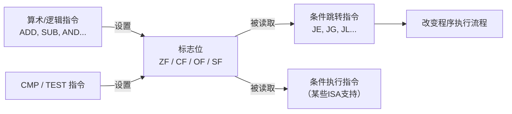

## 运算的"小票"

你去超市买东西，收银机打印小票，上面不仅有总价，还有**找零金额、支付方式、交易时间**等额外信息。

CPU 执行 [[arithmetic-logic-instructions|算术指令]] 也类似——除了得到运算结果，还会在 **状态寄存器（Status Register）** 中记录一些"小票信息"，这些信息就是**标志位**。

**标志位（Flags / Condition Codes）** 是一组 1 位的寄存器，由算术和逻辑指令自动设置，记录运算结果的特征：

- 结果是不是 0？
- 结果是正数还是负数？
- 有没有产生进位？
- 有没有溢出？

### 类比：汽车仪表盘

驾车时你通过仪表盘了解车辆状态：
- **ZF（零标志）** = "油箱空了"指示灯
- **SF（符号标志）** = 倒车灯（显示方向）
- **CF（进位标志）** = 里程表到了 999999 再走 1 公里变成 000000
- **OF（溢出标志）** = 速度表指针转过了最大刻度

## 四个核心标志位

### ZF — 零标志（Zero Flag）

**条件**：运算结果为 0 时 ZF = 1

```asm
MOV R1, #5
SUB R1, #5       ; 5 - 5 = 0 → ZF = 1 ✅
ADD R1, #3       ; 0 + 3 = 3 → ZF = 0 ❌
```

```
  SUB R1, #5      ALU 输出: 0 ──→ ZF = 1
```

> 每次你想判断"两个数是否相等"时，就用减法或 CMP——如果 ZF 被置为 1，说明结果为零，两数相等。

### SF — 符号标志（Sign Flag）

**条件**：运算结果为负数时 SF = 1

SF 其实就是结果的**最高位（符号位）**：

```asm
MOV R1, #10
SUB R1, #20      ; 10 - 20 = -10 → 最高位为 1 → SF = 1
ADD R1, #25      ; -10 + 25 = 15 → 最高位为 0 → SF = 0
```

```
  10 - 20 = -10
  二进制：1111 0110
          ↑
    最高位是 1 → 负数 → SF = 1
```

### CF — 进位标志（Carry Flag）

CF 记录**无符号数运算**中的进位或借位，由两种情况触发：

**① 加法进位**：结果超出 N 位无符号数的表示范围

```asm
; 8 位无符号数的范围是 0~255
MOV R1, #0xFF     ; R1 = 255（8位最大值）
ADD R1, #1        ; 255 + 1 = 256 → 8位装不下 → CF = 1
```

```
   1111 1111  (255)
+  0000 0001  (1)
  ----------
  1 0000 0000  (256)
  ↑
  这第9位就是进位 → CF = 1
```

**② 减法借位**：小的数减大的数，需要"借位"

```asm
MOV R1, #0        ; R1 = 0
SUB R1, #1        ; 0 - 1 → 不够减，需要借位 → CF = 1
```

### OF — 溢出标志（Overflow Flag）

OF 记录**有符号数运算**中的溢出——结果超出了有符号数的表示范围。

```asm
; 8 位有符号数的范围是 -128~127
MOV R1, #0x7F     ; R1 = 127（8位有符号最大值）
ADD R1, #1        ; 127 + 1 = 128 → 但 8 位有符号数最大是 127 → OF = 1
```

```
   0111 1111  (127, 有符号数)
+  0000 0001  (1)
  ----------
   1000 0000  (结果 = -128！符号位翻转了)
   ↑
   正 + 正 = 负 → 明显出错 → OF = 1
```

## CF vs OF：最重要的区别

这是初学者最容易混淆的概念。关键区别在于：

| 标志 | 用于 | 判断的是 | 谁关心 |
|------|------|---------|--------|
| **CF** | **无符号数** | 有没有超出 0 到 2ᴺ-1 的范围 | 地址计算、位操作 |
| **OF** | **有符号数** | 有没有超出 -2ᴺ⁻¹ 到 2ᴺ⁻¹-1 的范围 | 普通算术运算 |

### 类比：两种不同的"装不下"

- **CF** = 你有一个**只能装 255 毫升的杯子**（无符号），倒了 256 毫升——水溢出了。这就是进位。
- **OF** = 你有一个**能装 -128 到 127℃ 的温度计**（有符号），测了 128℃——指针转到了 -128℃！这就是溢出。

### 同一个运算，CF 和 OF 可能不同

```asm
; 8 位示例
MOV R1, #0x80    ; R1 = 128（当作无符号）/ -128（当作有符号）
ADD R1, #0x80    ; 加上 128（无符号）/ -128（有符号）
                 ; 二进制结果：0x100（100000000）
                 ; 截断到 8 位：0x00

; 无符号视角：
; 128 + 128 = 256 → 超出了 0~255 的范围 → CF = 1

; 有符号视角：
; (-128) + (-128) = -256 → 超出了 -128~127 的范围 → OF = 1
; 但等等，-256 确实比 -128 小，结果截断后是 0——不对！
```

> 💡 OF = 1 意味着从有符号角度看，结果符号"翻转"了。最简单的判断方法：**如果两个正数相加得到负数，或两个负数相加得到正数，那 OF 一定为 1。**

## CMP 指令——专门设置标志位

`CMP`（Compare）是汇编中最常用的"测试"指令之一。它执行减法**但不保存结果**——只为了设置标志位：

```asm
CMP R1, R2       ; 计算 R1 - R2，只更新标志位，不存结果
```

CMP 执行后，标志位的变化告诉程序员两个数的关系：

| CMP R1, R2 | 标志位状态 | 含义 |
|-----------|-----------|------|
| R1 == R2 | ZF = 1 | 两数相等 |
| R1 != R2 | ZF = 0 | 两数不等 |
| R1 > R2（有符号） | SF = 0 且 ZF = 0 | 正且不为零 |
| R1 < R2（有符号） | SF = 1 | 结果为负 |
| R1 > R2（无符号） | CF = 0 且 ZF = 0 | 无借位且不为零 |
| R1 < R2（无符号） | CF = 1 | 有借位 |

```asm
; 判断两个变量是否相等
LOAD R1, [addr_a]   ; 把 a 从内存加载到 R1
LOAD R2, [addr_b]   ; 把 b 从内存加载到 R2
CMP R1, R2          ; 比较 a 和 b
; 此时 ZF 已经反映了比较结果
; 后续可以用条件跳转指令（JE / JNE）根据 ZF 做不同处理
```

## TEST 指令——按位测试

`TEST` 类似 CMP，但执行的是**按位与**而不是减法——也只设置标志位，不存结果：

```asm
TEST R1, R2        ; 计算 R1 & R2，只更新标志位
```

**用途①：检查某一位是否为 1**

```asm
; 检查 R1 的第 3 位是否为 1
TEST R1, #0b100    ; 二进制 100
; 如果 ZF = 1 → 第 3 位为 0
; 如果 ZF = 0 → 第 3 位为 1
```

**用途②：检查寄存器是否为 0**

```asm
TEST R1, R1        ; R1 & R1 = R1，结果不为 0 则 ZF = 0
; 等价于 CMP R1, #0，但一条指令更短
```

> 这就是为什么编译器生成的代码中，你常看到 `TEST R1, R1` 而不是 `CMP R1, #0`——前者少占用一个立即数。

## 标志位的生命周期



> ⚠️ **每次算术运算都会覆盖标志位**。如果你需要保存某次运算的标志位，必须在下一个算术指令之前使用它——否则就被冲掉了。

## 实际运用：C 语言的 if 如何映射到标志位

```c
// C 代码
if (a > b) {
    max = a;
} else {
    max = b;
}
```

等价的汇编逻辑——标志位和条件跳转如何协作：

```asm
; 假设 a=R1, b=R2
    CMP R1, R2         ; 计算 R1 - R2 并设置标志位
    JLE ELSE           ; 如果 SF=1 或 ZF=1（R1 ≤ R2），跳到 ELSE
    MOV R3, R1         ; max = a
    JMP DONE
ELSE:
    MOV R3, R2         ; max = b
DONE:
```

`CMP` 指令只设置标志位、不保存计算结果。`JLE` 读取 SF 和 ZF 的值决定是否跳转——**标志位就是 CMP 和条件跳转之间的"信使"。**

## 小结

标志位是 CPU 运算的"副产品"，却是程序做出判断和分支的基础：

| 标志 | 全称 | 含义 | 典型判断 |
|------|------|------|---------|
| ZF | Zero Flag | 结果是否为 0 | 两数是否相等 |
| SF | Sign Flag | 结果是否为负 | 大小判断 |
| CF | Carry Flag | 无符号溢出/借位 | 无符号数的大小判断 |
| OF | Overflow Flag | 有符号溢出 | 有符号数的大小判断 |

标志位的真正威力在于它们可以被 **条件跳转指令** 读取——这就是计算机"做决策"的方式。接下来，你将学习如何用这些标志位实现 if/else 和循环：[[branch-jump-instructions|分支与跳转指令]]。
