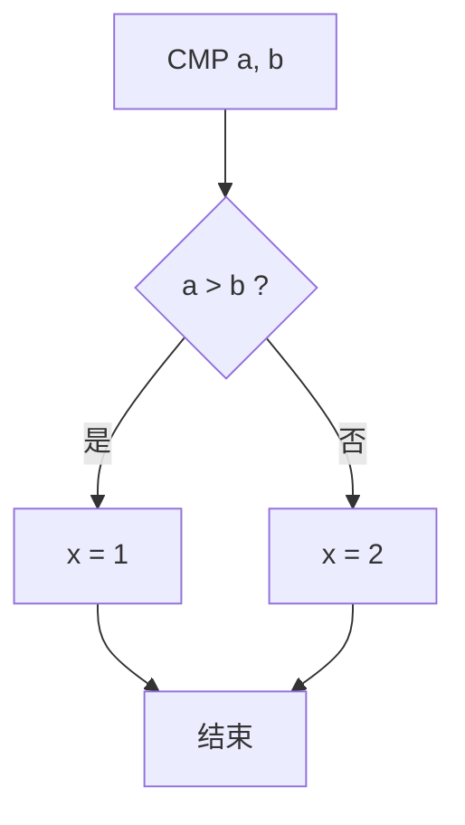

## 程序不只是"顺序执行"

到目前为止，我们写的汇编程序都是**顺序执行**的——指令一条接一条往下跑。但真正的程序需要**做决策**：

- 如果用户输入了密码 → 登录；否则 → 报错
- 重复计算直到得出结果

**分支与跳转指令** 就是用来改变执行流程的——让 CPU 跳到指定的地址继续执行，而不是傻傻地走下一行。

### 类比：游戏中的岔路

你玩 RPG 游戏，走到一个岔路口：
- **顺序执行** = 只有一条直路，没得选
- **无条件跳转（JMP）** = 看到传送门，直接传到另一张地图
- **条件跳转** = 路口有路牌："如果持有钥匙 → 走左边，否则 → 走右边"

### CPU 如何记住执行到哪了？

CPU 内部有一个 **PC（Program Counter，程序计数器）** 寄存器，它永远指向"下一条要执行的指令"的地址。正常情况下，每执行完一条指令，PC = PC + 指令长度。

**跳转指令的本质就是修改 PC**——让 CPU 跳到别处去执行：

```
正常执行：             跳转后：
PC → 指令1              PC → 指令1
PC → 指令2              PC → 指令2
PC → 指令3              跳转！  ──→ PC = LOOP_START
PC → 指令4                           │
PC → 指令5                           ↓
                         PC → LOOP_START 的指令
                         PC → LOOP_START 的下一条
```

## 无条件跳转：JMP

`JMP`（Jump）是无条件跳转——CPU 必定会跳，没有例外：

```asm
JMP loop_start    ; 直接跳到 loop_start 标签处
```

### 标签（Label）

标签是地址的"别名"——让汇编器帮你计算地址，而不是手动写数字：

```asm
    MOV R1, #0       ; 初始化
    JMP check_done   ; 跳到下面去检查

loop_start:
    ADD R1, #1       ; R1 加 1
    JMP loop_start   ; 跳回去，形成循环

check_done:
    ; 继续执行...
```

```
内存地址：
0x100:  MOV R1, #0
0x104:  JMP 0x110     ← 汇编器把 check_done 翻译成了 0x110
0x108:  ADD R1, #1    ← loop_start = 0x108
0x10C:  JMP 0x108     ← 跳回 loop_start
0x110:  ...           ← check_done = 0x110
```

> 💡 不需要记住地址数字——写标签名，汇编器会自动换算。标签就是给内存地址起的"外号"。

## 条件跳转

条件跳转根据 [[flags-condition-codes|标志位]] 决定是否跳转。**先执行 CMP 设置标志位，再用条件跳转读取标志位**——这是标准的"比较+分支"模式。

### 相等性判断

```asm
CMP R1, R2         ; 比较 R1 和 R2
JE  equal_label    ; 如果相等（ZF=1）则跳转
JNE not_equal_label ; 如果不相等（ZF=0）则跳转
```

| 指令 | 全称 | 判断条件 |
|------|------|---------|
| `JE` / `JZ` | Jump if Equal / Zero | ZF = 1 |
| `JNE` / `JNZ` | Jump if Not Equal / Not Zero | ZF = 0 |

### 有符号数大小判断

```asm
CMP R1, R2
JG  greater_label   ; R1 > R2  (有符号)
JGE ge_label        ; R1 ≥ R2
JL  less_label      ; R1 < R2
JLE le_label        ; R1 ≤ R2
```

| 指令 | 含义 | 标志位条件 |
|------|------|-----------|
| `JG` | Jump if Greater | SF = OF 且 ZF = 0 |
| `JGE` | Jump if Greater or Equal | SF = OF |
| `JL` | Jump if Less | SF ≠ OF |
| `JLE` | Jump if Less or Equal | SF ≠ OF 或 ZF = 1 |

### 无符号数大小判断

对于无符号数，使用 **A（Above）** 和 **B（Below）** 系列指令：

```asm
CMP R1, R2
JA  above_label     ; R1 > R2  (无符号, CF=0 且 ZF=0)
JAE above_eq_label  ; R1 ≥ R2 (无符号, CF=0)
JB  below_label     ; R1 < R2 (无符号, CF=1)
JBE below_eq_label  ; R1 ≤ R2 (无符号, CF=1 或 ZF=1)
```

### 容易混淆的陷阱

> ⚠️ `JG`（有符号）和 `JA`（无符号）看起来都是"大于"，但判断的标志位不同。用错会导致灾难性的 bug：

```asm
MOV R1, #0xFF      ; R1 = 255（无符号）/ -1（有符号）
MOV R2, #0x01      ; R2 = 1（不管有符号还是无符号）

CMP R1, R2
JG  signed_greater ; ❌ 不会跳转！因为 -1 并不大于 1（有符号视角）
JA  unsigned_above ; ✅ 会跳转！因为 255 大于 1（无符号视角）
```

## 实现 if/else

```asm
; 高级语言: if (a > b) { x = 1; } else { x = 2; }

LOAD R1, [addr_a]   ; R1 = a
LOAD R2, [addr_b]   ; R2 = b
CMP R1, R2          ; 比较 a 和 b
JLE else_part       ; 如果 a ≤ b，跳去 else

; if 分支 (a > b)
MOV R3, #1          ; x = 1
JMP end_if          ; 跳过 else 分支（否则会"掉进"else里！）

else_part:
MOV R3, #2          ; x = 2

end_if:
STORE R3, [addr_x]  ; 存回内存
```



> 🔑 **关键模式**：`JLE else_part` 跳过 if 分支 + 末尾的 `JMP end_if` 跳过 else 分支——这是 if/else 在汇编层面的标准模板。

## 实现循环

### while 循环

```asm
; 高级语言: while (i < 10) { sum += i; i++; }

    MOV R1, #0        ; R1 = sum（累加和）
    MOV R2, #0        ; R2 = i（循环变量）

loop_start:
    CMP R2, #10       ; 比较 i 和 10
    JGE loop_end      ; 如果 i ≥ 10，退出循环

    ADD R1, R1, R2    ; sum += i
    ADD R2, #1        ; i++

    JMP loop_start    ; 跳回去继续判断

loop_end:
    STORE R1, [result_addr]  ; 存结果
```

```
执行流程：
                    ┌──────────────────┐
                    │                  │
    ┌──→ CMP i, 10 ──→ JGE loop_end ──┤ (条件不满足时退出)
    │       │                         │
    │    i < 10 成立                   │
    │       │                         │
    │    sum += i                     │
    │    i++                          │
    └──── JMP ────────────────────────┘
```

### for 循环

```asm
; 高级语言: for (i = 0; i < 10; i++) { sum += i; }

    MOV R1, #0        ; R1 = sum
    MOV R2, #0        ; R2 = i（初始化）

for_loop:
    CMP R2, #10       ; 条件判断
    JGE for_end       ; 不满足则退出

    ADD R1, R1, R2    ; 循环体：sum += i

    ADD R2, #1        ; 递增 i
    JMP for_loop      ; 回到条件判断

for_end:
    STORE R1, [result_addr]
```

> 🔍 注意：for 循环、while 循环在汇编层面**没有区别**——都是"条件判断 → 循环体 → 跳回 → 条件判断"的模式。高级语言的区分是语法糖，底层都是同一个模式。

### do-while 循环

```asm
; do { sum += i; i++; } while (i < 10);

    MOV R1, #0
    MOV R2, #0

do_start:
    ADD R1, R1, R2    ; 先执行循环体
    ADD R2, #1

    CMP R2, #10       ; 再判断条件
    JL do_start       ; 如果 i < 10，继续循环

; 没有额外的 JMP——因为判断在循环体末尾！
```

do-while 比 while/for **少一条 JMP 指令**——因为条件判断在末尾，循环体执行完后自然可以决定是否跳回。

## 跳转指令的寻址方式

### 相对跳转 vs 绝对跳转

| 方式 | 含义 | 优点 | 缺点 |
|------|------|------|------|
| **绝对跳转** | 直接指定目标地址 | 简单直接 | 代码移动后地址失效 |
| **相对跳转** | 指定偏移量（如 +100 字节） | 代码可以整体移动（位置无关） | 跳转范围有限 |

现代操作系统大多使用**相对跳转**——程序加载到内存的什么位置都能正确运行（PIC，位置无关代码）：

```asm
JMP loop_start   ; 汇编器通常生成相对跳转
; 编码为: JMP + 0x1C（向前跳 28 字节）
```

## 条件跳转的常见错误

### 错误 1：忘记跳过 else

```asm
CMP R1, R2
JLE else_part
MOV R3, #1         ; if 分支
; ❌ 忘记写 JMP end_if，程序会"掉"进 else 分支！
else_part:
MOV R3, #2
end_if:
```

### 错误 2：用错有符号/无符号比较

```asm
MOV R1, #0xFFFF    ; 很大的无符号数
MOV R2, #0x0001
CMP R1, R2
JG  ...            ; ❌ 用了有符号比较，0xFFFF = -1，不大于 1
JA  ...            ; ✅ 应该用无符号比较
```

### 错误 3：标志位被意外覆盖

```asm
CMP R1, R2        ; 设置标志位
; ... 中间插入了别的指令 ...
ADD R3, #1        ; ⚠️ 这个 ADD 会覆盖标志位！
JE equal_label    ; ❌ 这里的 JE 读到的不是 CMP 设置的标志位
```

## 小结

分支与跳转指令让程序不再只是"一条道走到黑"，而是能够**做决策和重复执行**：

| 指令 | 用途 | 说明 |
|------|------|------|
| `JMP` | 无条件跳转 | 必须跳，用于循环和跳过 else |
| `JE` / `JNE` | 相等/不等跳转 | 判断是否相等 |
| `JG` / `JL` | 有符号大小判断 | 用于有符号整数 |
| `JA` / `JB` | 无符号大小判断 | 用于地址、位运算 |

掌握了算术指令（设置标志位）、条件码（标志位的含义）和分支跳转（读取标志位改变流程），你已经可以使用汇编实现**任何逻辑**——顺序、条件、循环，三种基本控制结构全部就位。

接下来，你将学习更高级的话题：当函数出现时，数据该放哪？——栈帧与函数调用约定（此内容将在后续章节详细讲解）。
